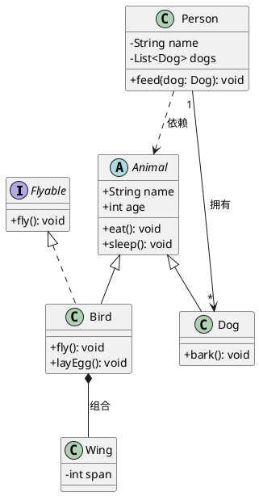

# UML 类图与关系

> 类图是面向对象系统建模的核心图表，展示类的结构以及类之间的 6 种关系。

## 类的结构

```
┌─────────────────────┐
│      ClassName       │  ← 类名
├─────────────────────┤
│ - field1: Type1     │  ← 属性（-表示private）
│ + field2: Type2     │  ← 属性（+表示public）
│ # field3: Type3     │  ← 属性（#表示protected）
│ ~ field4: Type4     │  ← 属性（~表示package）
├─────────────────────┤
│ + method1(): Return │  ← 方法
│ - method2(p: T): void│
└─────────────────────┘
```

**可见性修饰符**：`+` public、`-` private、`#` protected、`~` package

## 6 种核心关系（按耦合强度排列）

### 1. 依赖关系（Dependency）

**符号**：虚线箭头 `A - - -> B`
**含义**：临时使用，最弱的关系
**代码表现**：局部变量、方法参数、方法返回值

```java
public class Driver {
    public void drive(Car car) {  // Car作为参数
        car.start();
    }
}
```

**PlantUML**：`Driver ..> Car`

### 2. 关联关系（Association）

**符号**：实线箭头 `A -------> B`
**含义**：长期知道另一个类的存在
**代码表现**：成员变量（字段）

```java
public class Teacher {
    private Student student;  // 关联关系
}
```

**PlantUML**：`Teacher --> Student`

**变体**：
- 单向关联：带箭头 `A --> B`
- 双向关联：无箭头 `A -- B`
- 多重性：`"1" --> "*"`（一对多）

### 3. 聚合关系（Aggregation）

**符号**：空心菱形 + 实线 `A ◇--- B`
**含义**：整体与部分的弱拥有，部分可以独立于整体存在
**代码表现**：成员变量，部分对象可被共享

```java
public class Department {
    private List<Employee> employees;  // 员工可属于多个部门
}
```

**PlantUML**：`Department o-- Employee`

### 4. 组合关系（Composition）

**符号**：实心菱形 + 实线 `A ◆--- B`
**含义**：整体与部分的强拥有，部分不能独立于整体存在
**代码表现**：成员变量，部分对象由整体创建和管理

```java
public class House {
    private Room room = new Room();  // 房间不能脱离房子存在
}
```

**PlantUML**：`House *-- Room`

### 5. 泛化关系（Generalization）

**符号**：空心三角箭头实线 `A ---▷ B`
**含义**：继承关系，子类是父类的特化（is-a）
**代码表现**：`extends`

```java
public class Dog extends Animal { }
```

**PlantUML**：`Dog --|> Animal`

### 6. 实现关系（Realization）

**符号**：空心三角箭头虚线 `A - - -▷ B`
**含义**：类实现接口定义的契约
**代码表现**：`implements`

```java
public class ArrayList implements List { }
```

**PlantUML**：`ArrayList ..|> List`

## 关系强度对比

```
依赖 < 关联 < 聚合 < 组合 < 泛化/实现
(最弱)                    (最强)
```

**记忆技巧**：
- 依赖：临时使用（参数、局部变量）→ 虚线箭头
- 关联：长期知道（成员变量）→ 实线箭头
- 聚合：弱拥有，可共享（部门←员工）→ 空心菱形
- 组合：强拥有，不可共享（房子←房间）→ 实心菱形
- 泛化：is-a关系（继承）→ 空心三角实线
- 实现：implements（接口）→ 空心三角虚线

## 完整 PlantUML 类图示例



## 多重性标注

| 表示 | 含义 |
|------|------|
| `0..1` | 0个或1个 |
| `1` | 只能1个 |
| `0..*` 或 `*` | 0个或多个 |
| `1..*` | 1个或多个 |
| `n..m` | n到m个 |

## 适用场景

- 设计阶段定义领域模型
- 逆向工程理解现有代码结构
- API 设计和文档化
- 数据库模型设计的前期抽象
