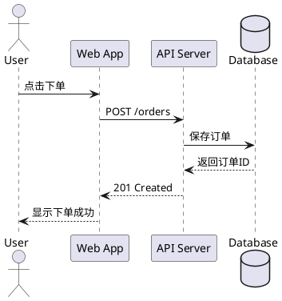
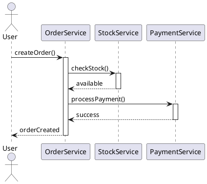
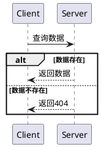
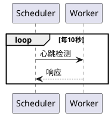
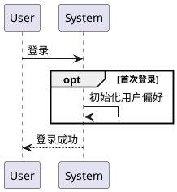
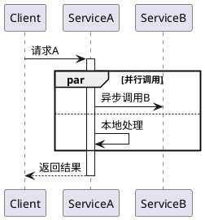
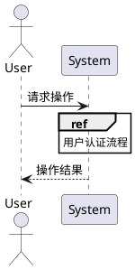
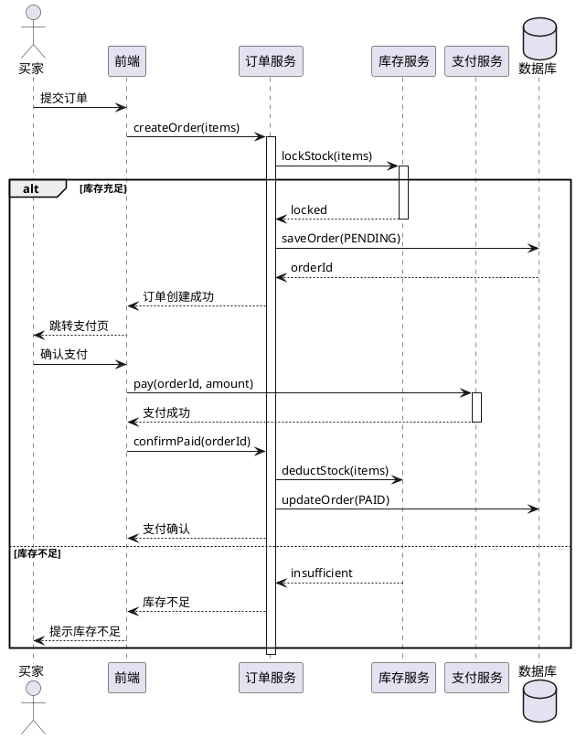

# UML 时序图

> 时序图展示对象之间按时间顺序的消息交换，强调交互的时间维度。

## 核心元素

### 对象与生命线（Lifeline）

对象以矩形框表示，其下方的垂直虚线为生命线，表示对象的存在时间。对象命名有三种方式：
- `对象:类`（如 `order:Order`）
- `:类`（匿名对象）
- `对象`（省略类名）

### 激活条（Activation Bar）

生命线上的窄矩形条，表示对象正在执行某个操作的时间段。

### 消息类型

| 消息类型 | 含义 | PlantUML 语法 |
|---------|------|---------------|
| 同步消息 | 发送方等待返回 | `A -> B: msg` |
| 异步消息 | 发送方不等待返回 | `A ->> B: msg` |
| 返回消息 | 同步调用的返回 | `B --> A: result` |
| 回调消息 | 异步回调 | `B -->> A: callback` |
| 自关联消息 | 对象调用自身方法 | `A -> A: self` |

### 组合片段（Combined Fragment）

| 类型 | 关键字 | 说明 |
|------|--------|------|
| 选择 | `alt` | if-else 分支 |
| 选项 | `opt` | 可选执行（if without else） |
| 循环 | `loop` | 重复执行 |
| 并行 | `par` | 并发执行 |
| 中断 | `break` | 跳出循环 |
| 引用 | `ref` | 引用其他交互片段 |

## PlantUML 语法详解

### 基本时序图

### 激活条与嵌套调用

### alt 条件分支

### loop 循环

### opt 可选片段

### par 并行执行

### ref 引用

## 完整实战示例：电商下单流程

## 绘制注意事项

1. **划清边界**：明确交互场景的范围，不要无限延伸
2. **对象排列**：交互频繁的对象尽量靠拢；初始化交互的对象放最左端
3. **消息粒度**：关注核心交互，省略不重要的细节
4. **编号可选**：复杂图可为消息加编号以便引用
5. **异步标注**：明确区分同步调用和异步消息

## 适用场景

- 设计 API 调用流程和微服务交互
- 分析复杂业务逻辑的执行顺序
- 调试分布式系统交互问题
- 技术方案评审中的时序分析
