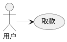
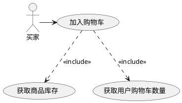
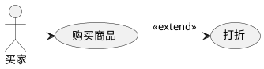
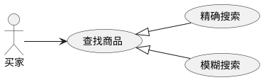
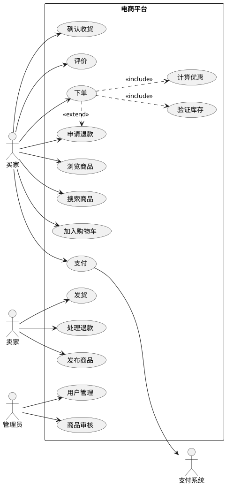

# UML 用例图

> 用例图从用户视角展示系统功能需求，是需求分析的核心工具。

## 核心概念

### 参与者（Actor）

参与者表示系统用户集合所扮演的角色（不是具体的人），可以是人、外部系统或硬件设备。参与者对子系统而言都是外部的，直接与系统进行交互。

### 用例（Use Case）

用例是对一组动作的描述，系统执行这些动作后对参与者产生可见结果。特征：从外部视角描述系统功能、对应一个具体的用户目标、在功能上具有完整性。

### 系统边界

用矩形框标识系统范围，用例在内，参与者在外。

## 用例之间的 4 种关系

### 关联关系（Association）

参与者与用例之间的交互。箭头指向用例。



### 包含关系（Include）

基本用例执行时**一定会**执行包含用例。箭头从基本用例指向包含用例。



**使用场景**：多个用例中有重复功能时，提取为公共用例。

### 扩展关系（Extend）

基本用例是完整的，扩展用例在**特定条件**下才被执行。箭头从扩展用例指向基本用例。



**使用场景**：表示可选行为或特定条件下的分支。

### 泛化关系（Generalization）

继承关系，子用例继承并定制父用例。空心三角箭头从子用例指向父用例。



## 关系对比总结

| 关系 | 执行条件 | 箭头方向 | 典型场景 |
|------|---------|---------|---------|
| 包含 | 必定执行 | 基本→包含 | 提取公共功能 |
| 扩展 | 条件触发 | 扩展→基本 | 可选功能 |
| 泛化 | 替代执行 | 子→父 | 行为变型 |

## 如何识别参与者

询问以下问题：
- 谁将使用系统的主要功能？
- 谁需要系统支持完成日常工作？
- 谁负责维护和管理系统？
- 系统需要与哪些外部系统交互？
- 系统需要处理哪些硬件设备？
- 谁对系统运行结果感兴趣？

## 如何识别用例

通过参与者来列出用例：
- 每个参与者执行什么操作？
- 参与者要向系统请求什么功能？
- 什么参与者会创建、修改、删除系统信息？
- 参与者需要通知系统外部变化吗？
- 系统需要通知参与者正在发生的事吗？

**约束**：每个用例至少有一个参与者，每个参与者至少一个用例。

## 用例描述模板

```
用例名称：[名称]
用例编号：UC-XXX
参与者：[参与者列表]
前置条件：[执行前必须满足的条件]
后置条件：[执行完成后的系统状态]
基本流程：
  1. [步骤1]
  2. [步骤2]
备选流程：
  2a. [备选步骤]
异常流程：
  3a. [异常处理]
```

## 完整实战示例：电商系统



## 适用场景关键词

当需要表达以下内容时使用用例图：
- "用户功能"、"角色权限"、"系统边界"
- "谁能做什么"、"系统对外提供的服务"
- 需求分析、系统功能范围定义、验收测试设计
