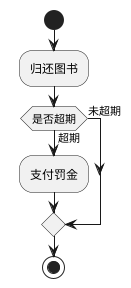
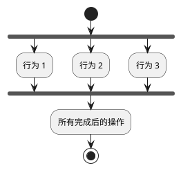
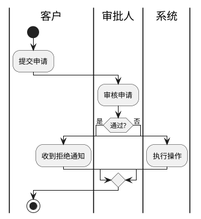
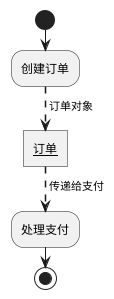
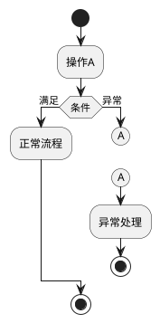
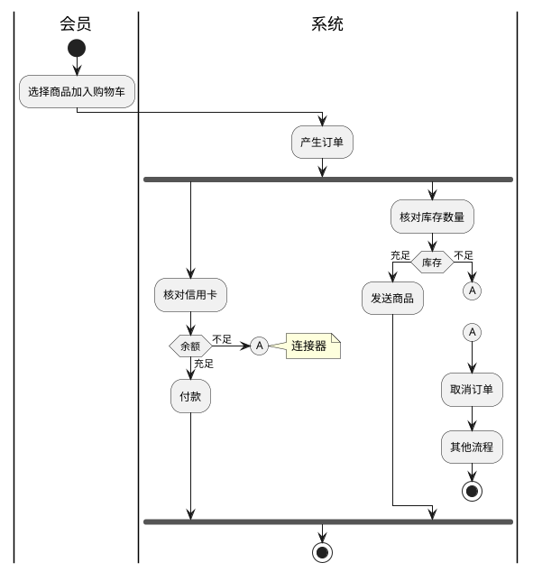

# UML 活动图

> 活动图展示业务流程、工作流或算法的控制流和数据流，支持并发与多角色协作。

## 概述

活动图是 UML 中的行为图，本质上是增强版流程图，着重表现从一个活动到另一个活动的控制流。它的独特优势在于能够表示并发活动和多角色泳道。

**优点**：描述并发行为、识别问题领域中的关键对象
**局限性**：不能直接展示对象协作、可能导致类职责混乱

## 核心元素

| 元素 | 说明 | PlantUML 语法 |
|------|------|--------------|
| 开始节点 | 流程起点（实心黑圆） | `start` |
| 结束节点 | 流程终点（双环圆） | `stop` |
| 活动（Action） | 一个具体操作步骤 | `:动作名;` |
| 控制流 | 连接活动的有向箭头（实线） | `->` 或 `-> 标注;` |
| 对象流 | 活动与对象的依赖（虚线） | `-[dashed]->` |
| 决策（Decision） | 条件分支（菱形） | `if ... then ... else ... endif` |
| 合并（Merge） | 任一分支到达即继续 | `endif` |
| 分叉（Fork） | 开启并行分支 | `fork` |
| 汇合（Join） | 所有分支到达才继续 | `end fork` |
| 泳道（Swimlane） | 划分不同对象的职责 | `\|泳道名\|` |

## PlantUML 语法详解

### 条件判断

### 并行处理

`end fork`：所有分支完成才继续（类似 CountDownLatch.await）
`end merge`：任一分支完成即继续

### 泳道

### 对象流

### 连接器与中断

## 完整实战示例：电商订单处理

## 活动图 vs 流程图

| 类型 | 特点 |
|------|------|
| 基础流程图 | 简单顺序步骤，无并发 |
| 活动图 | UML 规范，支持并发、泳道、对象流 |
| 业务流程图 | 带泳道的流程图，表述多角色业务流程 |
| 任务流程图 | 无泳道，表述单一任务步骤 |

## 适用场景关键词

当需要表达以下内容时使用活动图：
- "业务流程"、"审批流程"、"工作流"
- "算法步骤"、"并发处理"、"多角色协作流程"
- 任何需要展示并行执行或泳道分工的场景

## 建模最佳实践

1. 明确活动的粒度——每个活动是一个有意义的完整操作
2. 涉及多参与者时使用泳道明确职责
3. 在分支处清晰标注判断条件
4. 区分控制流（实线）和对象流（虚线）
5. 过于复杂时考虑拆分为多个子活动图
