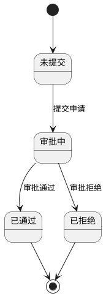
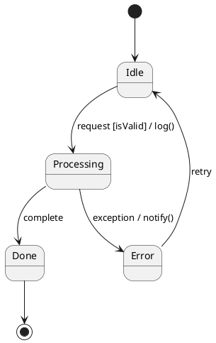
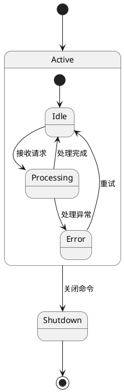
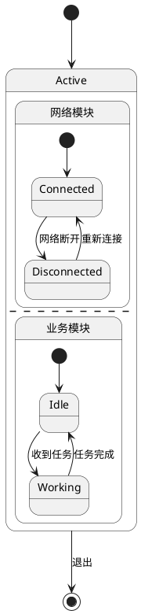
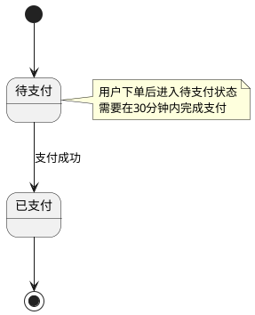
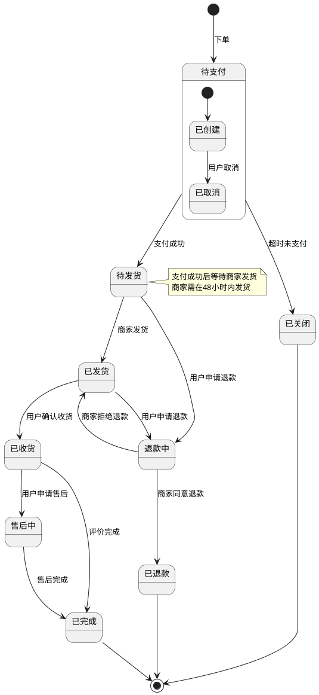

# UML 状态机图

> 状态机图展示对象在其生命周期中响应事件的状态变化，适合描述状态流转逻辑。

## 核心概念

### 有限状态机（FSM）要素

- **状态（State）**：对象在某个时刻的条件或情况
- **事件（Event）**：导致状态转换的触发器（调用事件、信号事件、时间事件、变化事件）
- **转换（Transition）**：从一个状态到另一个状态的变化
- **守卫条件（Guard）**：转换发生的前置条件，用 `[条件]` 表示
- **动作（Action）**：转换时执行的操作，用 `/ 动作` 表示

### 状态类型

| 类型 | 说明 | PlantUML |
|------|------|----------|
| 初始状态 | 状态机入口（实心黑圆） | `[*] -->` |
| 终止状态 | 状态机结束（双环圆） | `--> [*]` |
| 简单状态 | 无子状态（圆角矩形） | `state 名称` |
| 组合状态 | 含有子状态 | `state 名称 { ... }` |
| 并发状态 | 正交区域 | `--` 分隔符 |

## PlantUML 语法详解

### 基本状态机



### 守卫条件与动作



### 组合状态（子状态）



### 并发状态（正交区域）



### 注释



## 完整实战示例：电商订单状态机



## 状态机编程实现

### 方式一：枚举（简单场景）

每个枚举值实现转换逻辑，适用于状态少、逻辑简单的场景。

### 方式二：状态模式（GoF）

将每个状态封装为独立类，符合开闭原则，但类数量较多。

### 方式三：COLA StateMachine（推荐）

阿里开源轻量级框架，无状态、线程安全、流式 API：

```java
StateMachineBuilder<States, Events, Context> builder = 
    StateMachineBuilderFactory.create();

builder.externalTransition()
    .from(States.PENDING).to(States.PAID)
    .on(Events.PAY_SUCCESS)
    .when(checkCondition())
    .perform(doAction());

StateMachine<States, Events, Context> stateMachine = builder.build(ID);
States target = stateMachine.fireEvent(States.PENDING, Events.PAY_SUCCESS, ctx);
```

### 方式四：Spring State Machine

Spring 官方框架，支持层级状态、并行状态、持久化，适合复杂场景。

## 注意事项

1. **状态爆炸**：状态过多时使用组合状态（层级）简化
2. **事件幂等**：同一事件多次触发应保持幂等性
3. **持久化**：长期运行的状态机需考虑状态持久化
4. **异常路径**：不仅建模正常流程，也要覆盖异常和恢复

## 适用场景关键词

当需要表达以下内容时使用状态机图：
- "状态流转"、"生命周期"、"订单状态"
- "工作流状态"、"协议状态"、"UI组件状态"
- 任何对象在其生命周期中有明确状态变化的场景
