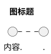
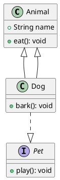
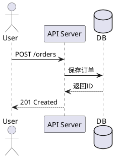
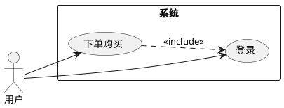
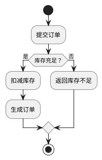
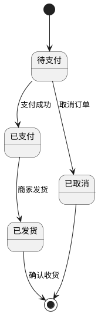

# PlantUML 使用指南与工具选型

> PlantUML 是使用文本描述生成 UML 图的开源工具，对版本控制和 CI/CD 集成友好。本文涵盖 PlantUML 使用方法及 UML 工具选型建议。

## PlantUML 基础

- **官网**：https://plantuml.com/zh/
- **文件扩展名**：`.puml` 或 `.plantuml`
- **输出格式**：PNG、SVG、ASCII Art
- **支持图表**：类图、时序图、用例图、活动图、状态图、组件图、部署图等

### 基本语法结构

所有文件以 `@startuml` 开头，`@enduml` 结尾：



## 安装与配置

### VS Code
1. 安装插件 "PlantUML"
2. 新建文件 `diagram.puml`
3. 按 `Alt+D` 预览图表

### IntelliJ IDEA
安装 PlantUML integration 插件，支持实时预览。

### 命令行
```bash
java -jar plantuml.jar diagram.puml
```

## 渲染服务

### Kroki（推荐）
- **地址**：https://kroki.io/plantuml/png
- **请求方式**：POST 纯文本
- **优势**：无长度限制，适合复杂图，支持多种图表格式

### PlantUML 官方
- **地址**：https://www.plantuml.com/plantuml/png/{encoded}
- **请求方式**：GET（需要 Deflate+Base64 编码）
- **限制**：URL 长度有限，适合简单小图

## 常用语法速查

### 类图



关系符号：`--|>`泛化、`..|>`实现、`-->`关联、`..>`依赖、`o--`聚合、`*--`组合

### 时序图



### 用例图



### 活动图



### 状态机图



## 高级技巧

### skinparam 样式定制
```plantuml
@startuml
skinparam classAttributeIconSize 0
skinparam backgroundColor #FEFEFE
skinparam class {
    BackgroundColor LightBlue
    BorderColor DarkBlue
}
@enduml
```

### 方向控制
```plantuml
left to right direction   ' 用例图横向
top to bottom direction   ' 默认纵向
```

### 注释
```plantuml
note right of ClassName : 注释内容
note left of Object
  多行注释
end note
```

## UML 工具选型

### 图形化工具（拖拽式）

| 工具 | 类型 | 特点 | 适用场景 |
|------|------|------|---------|
| draw.io | 开源免费 | Web/桌面版，无需安装 | 快速草图、团队讨论 |
| Visual Paradigm | 商业 | 功能最全面，支持代码生成 | 企业级大型项目 |
| StarUML | 商业 | 界面简洁，UML 2.x | 中小型项目 |

### 文本化工具（代码生成图）

| 工具 | 特点 | 适用场景 |
|------|------|---------|
| PlantUML | 功能强大，支持所有UML图 | 开发者日常、CI/CD集成 |
| Mermaid | 原生支持GitHub/GitLab | Markdown文档、README |

### IDE 集成

| 工具 | 特点 | 适用场景 |
|------|------|---------|
| IntelliJ Diagrams | 从代码生成类图，实时同步 | Java/Kotlin项目 |
| Eclipse Papyrus | UML 2.x完整规范 | Eclipse生态 |

### 选择建议

| 场景 | 推荐工具 |
|------|---------|
| 快速草图、团队讨论 | draw.io |
| 开发者日常使用 | PlantUML |
| GitHub 文档 | Mermaid |
| Java 项目逆向工程 | IntelliJ IDEA Diagrams |
| 企业级大型项目 | Visual Paradigm |

## AI 时代的 UML 绘图工作流

1. 用自然语言向 AI 描述系统结构
2. AI 生成 PlantUML 或 Mermaid 代码
3. 在 IDE 或在线编辑器中预览和调整
4. 导出图片或嵌入文档

能力矩阵：自然语言→图、代码→图、图→代码
