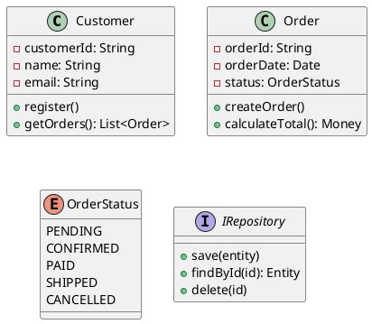
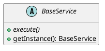
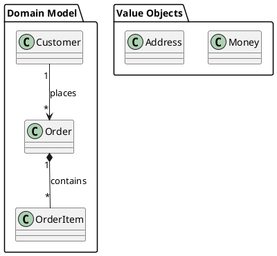
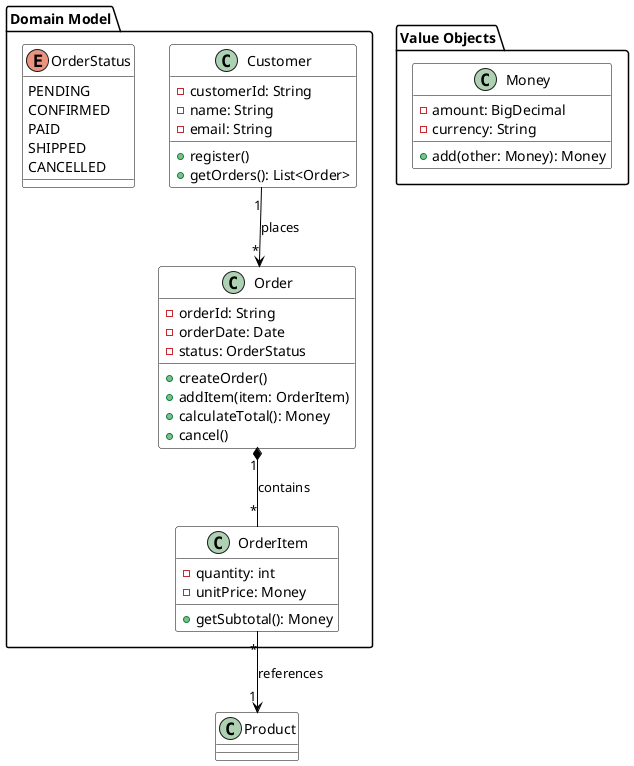

# 如何画类图 (Class Diagram)

> 类图是面向对象设计的核心图表，展示系统中的类、接口、属性、方法及它们之间的关系。

## 类图的基本结构

类在 UML 中表示为三格矩形：

```
┌─────────────────────┐
│      ClassName      │  ← 类名（PascalCase）
├─────────────────────┤
│ - attribute: Type   │  ← 属性（camelCase，带可见性修饰符）
│ + name: String      │
├─────────────────────┤
│ + method(): Return  │  ← 方法（camelCase，带可见性修饰符）
│ - process(param): void│
└─────────────────────┘
```

两个特殊元素：
- **接口 (Interface)**：只定义方法契约，无属性实现，PlantUML 中用 `interface` 关键字
- **枚举 (Enumeration)**：一组命名常量，PlantUML 中用 `enum` 关键字

## PlantUML 类定义语法

### 可见性修饰符

| 符号 | PlantUML 前缀 | 含义 |
|------|-------------|------|
| `-` | `-` | private |
| `+` | `+` | public |
| `#` | `#` | protected |
| `~` | `~` | package-private (default) |

### 基本类定义



### 抽象类和静态成员



## 六种类关系（按强度从弱到强）

### 关系速查表

| 关系 | 含义 | 代码表现 | PlantUML 语法 | 符号 |
|------|------|---------|--------------|------|
| **依赖 (Dependency)** | A 临时使用 B | 局部变量、方法参数、返回值 | `A ..> B` | 虚线箭头 `⇢` |
| **关联 (Association)** | A 长期知道 B | 成员变量（字段） | `A --> B` | 实线箭头 `→` |
| **聚合 (Aggregation)** | A 包含 B，B 可独立存在 | 成员变量，可共享 | `A o-- B` | 空心菱形 `◇—` |
| **组合 (Composition)** | A 拥有 B，B 不可独立存在 | 成员变量，整体创建/销毁 | `A *-- B` | 实心菱形 `◆—` |
| **泛化/继承 (Generalization)** | A 是 B 的一种 | `extends` (Java) | `A --|> B` | 空心三角实线 `▷—` |
| **实现 (Realization)** | A 实现接口 B | `implements` (Java) | `A ..|> B` | 空心三角虚线 `▷--` |

### 关系详解

#### 依赖 (Dependency) — 最弱

```java
public class Driver {
    public void drive(Car car) {  // Car 作为参数，形成依赖
        car.start();
    }
}
```

```plantuml
Driver ..> Car : uses
```

**语义**："Driver 临时使用 Car"

#### 关联 (Association)

```java
public class Teacher {
    private Student student;  // 成员变量，长期关系
}
```

```plantuml
Teacher "1" --> "*" Student : teaches
```

**语义**："Teacher 知道 Student"，可带多重性标注 `1..*`（一对多）。

#### 聚合 (Aggregation) — 弱拥有

```java
public class Department {
    private List<Employee> employees;  // 员工可以离开部门而存在
}
```

```plantuml
Department "1" o-- "*" Employee
```

**语义**："Department 包含 Employee，但 Employee 可独立存在"

#### 组合 (Composition) — 强拥有

```java
public class House {
    private Room room = new Room();  // 房间不能脱离房子
}
```

```plantuml
Order "1" *-- "*" OrderItem : contains
```

**语义**："Order 拥有 OrderItem，Order 销毁时 OrderItem 也销毁"

#### 泛化 (Generalization) — 继承

```java
public class Dog extends Animal { }
```

```plantuml
Dog --|> Animal
```

**语义**："Dog 是一种 Animal"

#### 实现 (Realization) — 接口实现

```java
public class ArrayList implements List { }
```

```plantuml
UserServiceImpl ..|> IUserService
```

**语义**："UserServiceImpl 承诺实现 IUserService 定义的所有操作"

### 多重性标注

| 标注 | 含义 |
|------|------|
| `1` | 恰好一个 |
| `0..1` | 零个或一个 |
| `*` 或 `0..*` | 零个或多个 |
| `1..*` | 至少一个 |
| `n..m` | n 到 m 个 |

### 关系强度排序

```
依赖 < 关联 < 聚合 < 组合 < 泛化/实现
(最弱)                            (最强)
```

## 包 (Package) 分组

用 `package` 将相关类组织在一起，表达模块结构：



## 完整示例：电商领域模型



## 类图建模最佳实践

### 职责分配原则（GRASP 核心）

画类图前，先思考职责分配，而不是数据结构：

1. **信息专家 (Information Expert)**：将职责分配给拥有所需信息的类。例如 `Order` 知道所有 `OrderItem`，所以由它计算总金额
2. **创建者 (Creator)**：如果 B 包含/聚合/使用 A，由 B 创建 A。例如 `Order` 创建 `OrderItem`
3. **低耦合 (Low Coupling)**：减少类之间的依赖，变更影响范围最小
4. **高内聚 (High Cohesion)**：每个类只做密切相关的事，职责单一
5. **防止变异 (Protected Variations)**：用接口隔离可能变化的部分

### 画图原则

- **聚焦于职责分配**：先定义对象应该做什么，再决定它有什么属性
- **每张图只关注一个视角**：不要把所有的类都放在一张图上
- **关系线只有必要的才画**：只画出对理解系统必需的关系
- **继承要谨慎**：组合/聚合通常优于继承（"组合优于继承"原则）
- **面向接口建模**：面向接口而非具体类建模，降低耦合
- **从关键概念开始**：先识别核心领域对象（Customer、Order、Product），再补充辅助类

### 常见误区

| 误区 | 正确做法 |
|------|---------|
| 试图画出所有类和关系 | 只画关键类和核心关系 |
| 混淆聚合和组合 | 问：部分能否独立存在？能→聚合，不能→组合 |
| 属性/方法列表过长 | 只列出关键属性和方法 |
| 画图后不维护 | PlantUML 纳入版本控制，与代码一起更新 |
