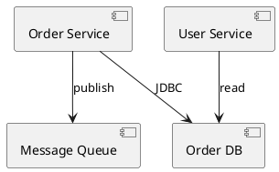
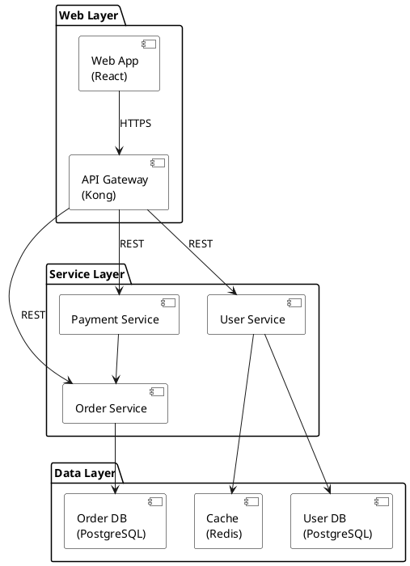
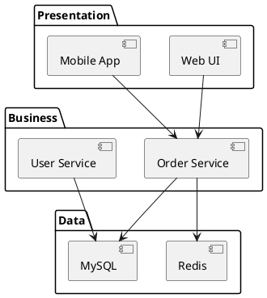
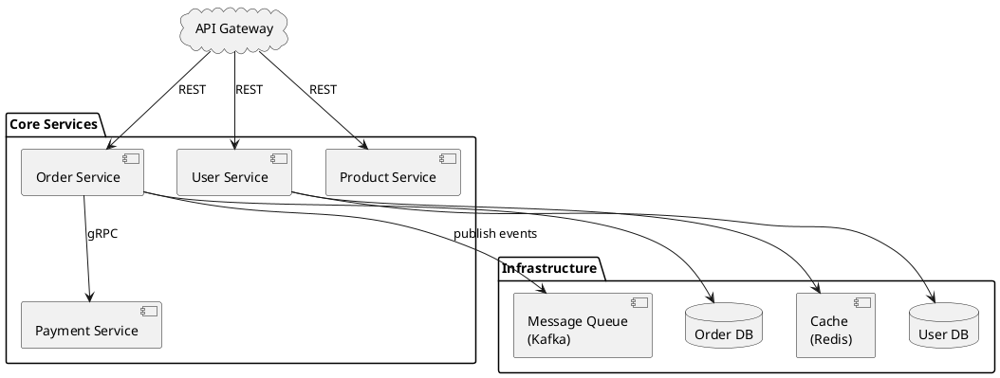

# 如何画组件图 (Component Diagram)

> 组件图展示系统如何分解为模块化、可替换的软件组件，以及它们之间的接口和依赖关系。是架构设计中最常用的图表之一。

## 组件图的用途

组件图回答的是"系统由哪些软件部件组成，它们之间如何通信"：
- 展示软件系统的高层模块分解
- 描述组件之间的接口契约和依赖方向
- 为微服务架构、分层架构提供可视化蓝图
- 帮助识别循环依赖和架构边界

## 关键元素

| 元素 | PlantUML 表示 | 说明 |
|------|-------------|------|
| **组件 (Component)** | `component [名称]` 或 `[名称]` | 系统的模块化单元，如一个微服务、一个库、一个子系统 |
| **接口 (Interface)** | `interface "名称"` | 组件对外暴露的服务契约（提供接口 / 需要接口） |
| **包 (Package)** | `package "名称" {}` | 逻辑分组，如按层 (Web/Service/Data) 或按域 |
| **数据库 (Database)** | `database "名称"` | 数据存储组件的特殊表示 |
| **队列 (Queue)** | `queue "名称"` | 消息队列组件的特殊表示 |
| **依赖 (Dependency)** | `A --> B` 或 `A ..> B` | 组件 A 依赖组件 B |

## PlantUML 语法

### 基本组件定义



### 带接口的组件

```plantuml
@startuml
' 提供接口 (lollipop notation)
interface "IOrderAPI" as API

[Order Service] -()- API  ' 组件提供接口
[Web App] --> API           ' 其他组件依赖接口
@enduml
```

### 分层架构（最常见模式）



## 常见架构模式

### 三层架构

```
Presentation Layer（表现层）
    ↓ 依赖
Business Layer（业务层）
    ↓ 依赖
Data Layer（数据层）
```



### 微服务架构



## 组件图建模步骤

1. **识别系统边界**：哪些组件属于本系统，哪些是外部系统？
2. **确定组件粒度**：组件是一个微服务？一个模块？一个库？粒度要与讨论的目标一致
3. **定义组件间的通信方式**：同步（REST/gRPC）还是异步（消息队列）？
4. **标注依赖方向**：箭头从依赖方指向被依赖方，避免双向依赖
5. **添加接口**：对于关键的组件边界，标注接口契约

## 最佳实践

- **依赖方向要清晰**：箭头始终指向被依赖方，遵循"依赖倒置原则"——高层不依赖低层，都依赖抽象
- **分层要严格**：上层可依赖下层，下层不能依赖上层（避免循环依赖）
- **接口优先于实现**：展示组件的接口契约，而非内部细节
- **一个图一个视角**：不要在一张图上混合展示组件粒度（微服务 + 类层次不要混在一起）
- **标注通信协议**：在依赖线上标注 `REST`、`gRPC`、`JDBC`、`Kafka` 等，让图自解释
- **组件数量控制在 15 个以内**：超过则拆分为多张图（如按层拆分、按业务域拆分）
- **使用颜色区分层次**：表现层、业务层、数据层用不同背景色区分

## 常见误区

| 误区 | 正确做法 |
|------|---------|
| 组件粒度过细（每个类都是一个组件） | 组件代表可独立部署/替换的模块，通常是一个服务或一个库 |
| 没有标注依赖方向 | 箭头从调用方指向被调用方 |
| 循环依赖 | 引入接口或消息队列解耦循环 |
| 所有组件平铺在一层 | 按逻辑分层或按业务域分组 |
