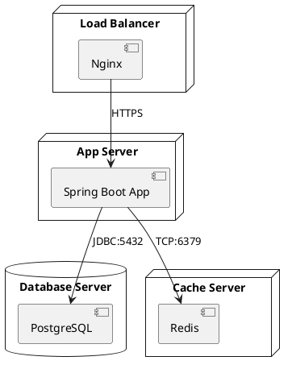
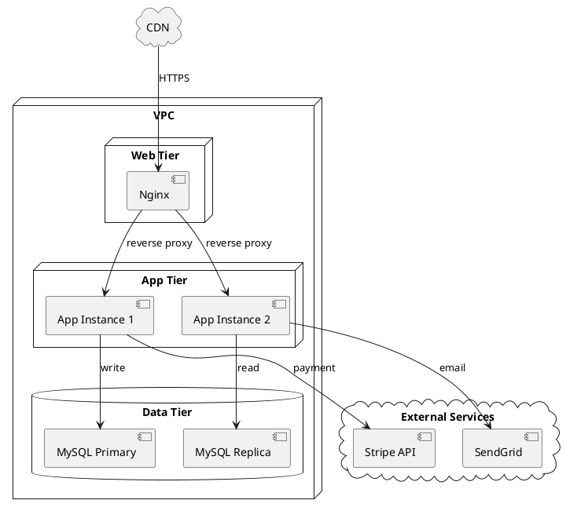
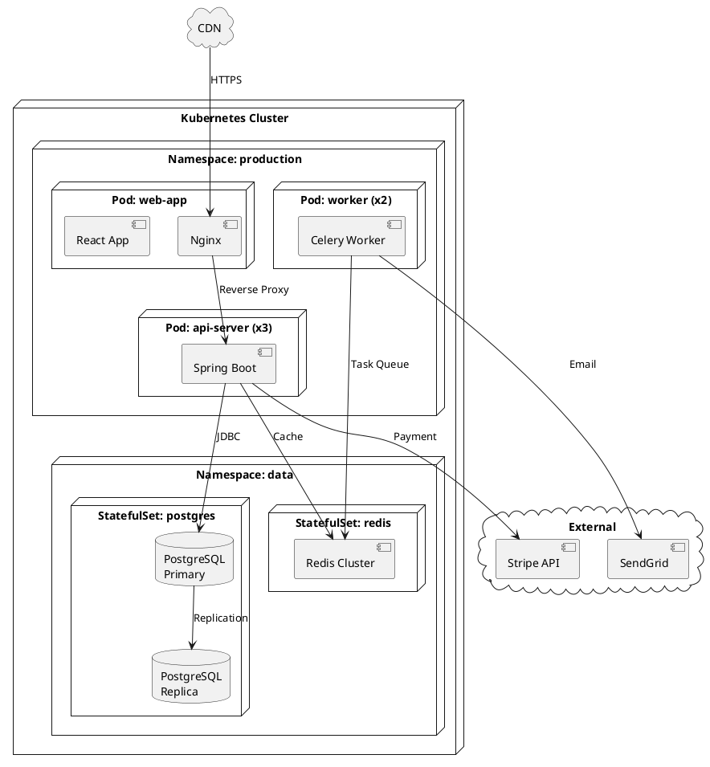
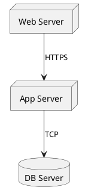
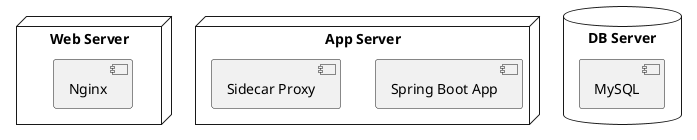

# 如何画部署图 (Deployment Diagram)

> 部署图展示系统的物理运行时拓扑——软件制品部署在哪些节点上，节点之间如何通信。是运维、DevOps 和基础设施规划的核心图表。

## 部署图的用途

部署图回答的是"系统运行在哪些机器上，它们之间如何连接"：
- 描述服务器、容器、云资源的物理/虚拟拓扑
- 展示软件组件与硬件节点的映射关系
- 规划网络通信路径和协议
- 为容量规划、灾备设计提供可视化参考
- Kubernetes 集群、云原生架构的标配文档

## 关键元素

| 元素 | PlantUML 表示 | 说明 |
|------|-------------|------|
| **节点 (Node)** | `node "名称" {}` | 物理/虚拟机、容器 Pod、云实例 |
| **制品 (Artifact)** | `[名称]` | 部署在节点上的软件（JAR、WAR、Docker 镜像） |
| **数据库 (Database)** | `database "名称"` | 数据库实例的特殊节点 |
| **云 (Cloud)** | `cloud "名称"` | 云服务或外部系统的抽象 |
| **通信路径** | `A --> B : 协议` | 节点之间的网络连接和协议 |
| **嵌套节点** | 盒子套盒子 | 容器/执行环境的层次关系 |
| **集合 (Collections)** | `collections "名称"` | 多个同类节点组成的集合 |
| **帧 (Frame)** | `frame "名称" {}` | 逻辑分组，如命名空间、VPC、区域 |

## PlantUML 语法

### 基本部署图

### 带云服务的部署图

### Kubernetes 部署图

## 部署图层次：从简到详

### 层次 1：宏观拓扑（节点级）

只展示节点和通信协议，适合架构评审：

### 层次 2：容器级拓扑

展示每个节点上运行的软件：

### 层次 3：完整云原生拓扑

展示命名空间、Pod、StatefulSet、外部服务等全部细节（见上方 Kubernetes 部署图）。

## 常见部署拓扑模式

| 模式 | 描述 | 适用场景 |
|------|------|---------|
| **单节点** | 所有服务部署在一台机器 | 开发/测试环境 |
| **分层部署** | Web / App / DB 分层部署 | 中小型应用 |
| **多实例 + 负载均衡** | 多台 App Server + LB | 高可用 Web 应用 |
| **主从数据库** | Primary + Replica | 读写分离、灾备 |
| **K8s 集群** | Pod + Service + StatefulSet | 云原生、微服务 |
| **多云/混合云** | 跨云供应商或跨区域 | 灾备、合规 |

## 部署图建模步骤

1. **识别物理/虚拟节点**：有哪些服务器、容器、云资源？
2. **确定节点上的软件**：每个节点运行什么软件制品？
3. **绘制嵌套层次**：集群 → 命名空间 → Pod → 容器
4. **标注通信路径**：节点间用什么协议通信？（HTTPS、JDBC、gRPC、TCP）
5. **标注端口**：关键端口号（3306、6379、8080）
6. **区分内部/外部**：用 `cloud` 表示外部依赖，`node` 表示内部节点

## 最佳实践

- **从宏观到微观**：先画出高层拓扑（Web/App/DB），再逐步细化容器和实例
- **协议要标注清楚**：简单的 `HTTPS`、`JDBC`、`gRPC` 标签让图自解释
- **使用嵌套节点表达层次**：K8s Cluster → Namespace → Pod → Container
- **区分实例数量**：标注 `(x3)` 表示多个实例
- **外部服务用 cloud**：避免混淆内部和外部依赖
- **物理和逻辑分开**：部署图聚焦物理拓扑，不要混入组件交互细节（交给时序图）
- **节点数量控制在 10 个以内**：超过则拆细（先概览拓扑，再逐个子系统深入）

## 与组件图的区别

| 维度 | 组件图 | 部署图 |
|------|-------|--------|
| 关注点 | 逻辑结构：系统由哪些软件组件组成 | 物理拓扑：组件运行在哪些节点上 |
| 元素 | component、interface、package | node、database、cloud、artifact |
| 表达内容 | 组件间依赖和接口契约 | 节点间网络连接和部署位置 |
| 受众 | 开发人员、架构师 | 运维、DevOps、架构师 |
| 典型问题 | "Order Service 依赖哪些服务？" | "Order Service 部署在哪个集群的哪个 Pod？" |
