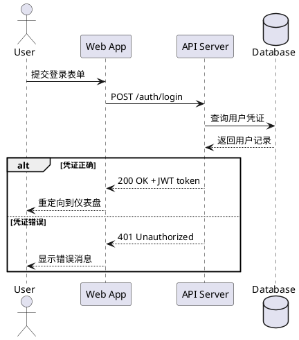
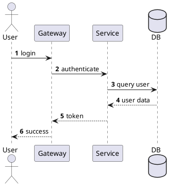

# 如何画时序图 (Sequence Diagram)

> 时序图展示对象之间如何按时间顺序进行消息交互，是设计 API 调用流程、分析分布式交互、验证协作逻辑的首选图表。

## 时序图的用途

时序图回答的是"完成一个操作，哪些对象参与了，它们之间按什么顺序传递了什么消息"：
- 设计 API 调用流程（请求→响应链路）
- 分析分布式系统交互（微服务间调用）
- 调试复杂业务逻辑的执行顺序
- 在编码前确认服务间协作契约
- Sprint Planning 中讨论实现方案

## 关键元素

### 参与者 (Participant)

```plantuml
@startuml
actor "用户" as User           ' 人类用户
participant "Web App" as Web   ' 软件组件（默认）
participant "API Server" as API
database "Database" as DB      ' 数据库
queue "Message Queue" as MQ    ' 消息队列
collections "External API" as Ext ' 外部服务集合
@enduml
```

| 参与者类型 | PlantUML 关键字 | 图标 |
|-----------|---------------|------|
| 用户/角色 | `actor` | 小人图标 |
| 组件/服务 | `participant` | 矩形框 |
| 数据库 | `database` | 圆柱体 |
| 消息队列 | `queue` | 队列图标 |
| 外部系统集合 | `collections` | 多层矩形 |

### 消息类型

| 消息类型 | 箭头样式 | PlantUML 语法 | 说明 |
|---------|---------|--------------|------|
| 同步消息 | 实线实心箭头 → | `A -> B: message` | 调用方等待返回 |
| 异步消息 | 实线开放箭头 → | `A ->> B: message` | 调用方不等待 |
| 返回消息 | 虚线开放箭头 ⇢ | `A --> B: response` | 方法返回值 |
| 自调用 | 箭头指向自身 | `A -> A: message` | 对象调用自己的方法 |
| 创建消息 | 实线开放箭头 → | `A ->> B: <<create>>` | 创建新对象 |

### 激活条 (Activation Bar)

表示对象正在执行操作的时间段：

```plantuml
@startuml
participant A
participant B

' 手动激活
activate A
A -> B: request
activate B
B --> A: response
deactivate B
deactivate A

' 简写（自动激活/取消）
A ->++ B: request
B -->-- A: response
@enduml
```

### 组合片段 (Combined Fragments)

控制逻辑的可视化表达：

| 片段类型 | 用途 | PlantUML 语法 |
|---------|------|--------------|
| `alt` | 条件分支（if-else） | `alt 条件` ... `else 条件` ... `end` |
| `opt` | 可选行为（if） | `opt 条件` ... `end` |
| `loop` | 循环 | `loop 次数或条件` ... `end` |
| `par` | 并行执行 | `par` ... `and` ... `end` |
| `critical` | 关键区域（原子操作） | `critical 描述` ... `end` |
| `break` | 中断/异常退出 | `break 条件` ... `end` |
| `group` | 通用分组标注 | `group 描述` ... `end` |

## PlantUML 完整示例

### 基本请求-响应流程



### 微服务订单创建（含循环和并行）

```plantuml
@startuml
actor Customer
participant "Order Service" as OS
participant "Inventory Service" as IS
participant "Payment Service" as PS
participant "Notification Service" as NS
queue "Message Queue" as MQ

Customer -> OS: createOrder(items)

loop 对每个商品
    OS -> IS: checkStock(productId, qty)
    IS --> OS: stockAvailable
end

alt 库存充足
    OS -> PS: processPayment(amount)
    PS --> OS: paymentSuccess
    
    OS -> MQ: publish(OrderCreatedEvent)
    
    par 并行通知
        MQ --> NS: OrderCreatedEvent
        NS -> NS: sendEmail()
    and
        MQ --> NS: OrderCreatedEvent  
        NS -> NS: sendSMS()
    end
    
    OS --> Customer: orderConfirmed
else 库存不足
    OS --> Customer: orderFailed
end
@enduml
```

### 带自调用和注释的流程

```plantuml
@startuml
participant "Auth Service" as Auth

Auth -> Auth: validateToken(token)
activate Auth

note right of Auth
  <b>验证逻辑：</b>
  1. 检查 token 格式
  2. 验证签名
  3. 检查过期时间
end note

Auth ->++ Auth: checkExpiry()
Auth -->-- Auth: valid

deactivate Auth
@enduml
```

### 使用 autonumber 自动编号



## 时序图建模步骤

1. **确定场景**：要描述哪个用例或操作的交互流程？
2. **列出参与者**：哪些对象/服务参与了这次交互？（从左到右排列，actor 在最左）
3. **按时间顺序写出消息**：谁先调用谁，传递了什么参数，返回了什么结果
4. **添加控制逻辑**：用 `alt/loop/opt/par` 表达条件分支和循环
5. **标注关键注释**：对于复杂逻辑添加 `note` 说明
6. **检查完整性**：确认所有消息都有明确的发送者和接收者

## 最佳实践

- **只展示关键交互**：忽略简单的 getter/setter 调用，聚焦核心业务流程
- **参与者数量 ≤ 8 个**：超过 8 个 lifeline 的时序图难以理解，拆分场景
- **使用组合片段表达复杂逻辑**：`alt/loop/opt/par` 远比文字说明直观
- **同步和异步消息要区分**：`->` 是同步（等待结果），`->>` 是异步（发出即返回）
- **激活条清晰表达并发**：用 `activate/deactivate` 或 `->++/-->--` 简写
- **autonumber 用于评审**：自动编号方便在评审中引用"第 N 步"
- **先画正常流程，再补异常分支**：`alt` 的主分支是 happy path
- **用 note 解释复杂逻辑**：协议细节、业务规则等不适合放在箭头文本中的信息

## 常见误区

| 误区 | 正确做法 |
|------|---------|
| 逐行翻译代码 | 画的是设计意图和协作模式，不是代码执行追踪 |
| lifeline 太多 | 超过 8 个就拆分；可用多层时序图（一张概览 + 多张细节） |
| 箭头方向混乱 | 从调用方指向被调用方；返回消息用 `-->` |
| 忽略异常路径 | alt 中至少包含成功/失败两个分支 |
| 消息文本太技术化 | 用业务语言描述而非代码方法签名；如"提交订单"而非"POST /api/v1/orders" |
| 所有消息都用同步 | 消息队列、事件通知应该用异步 `->>` |
