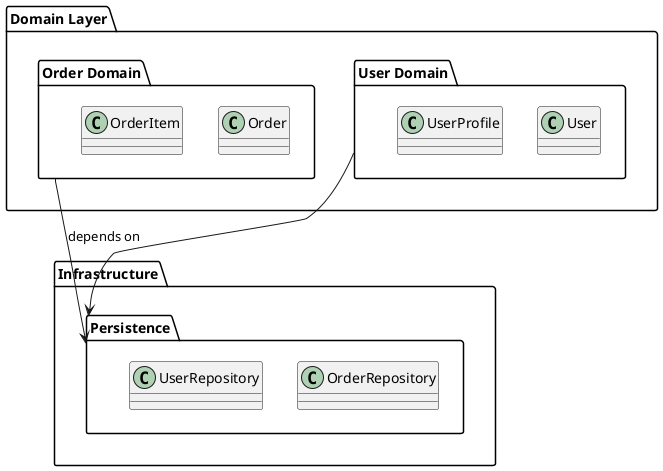
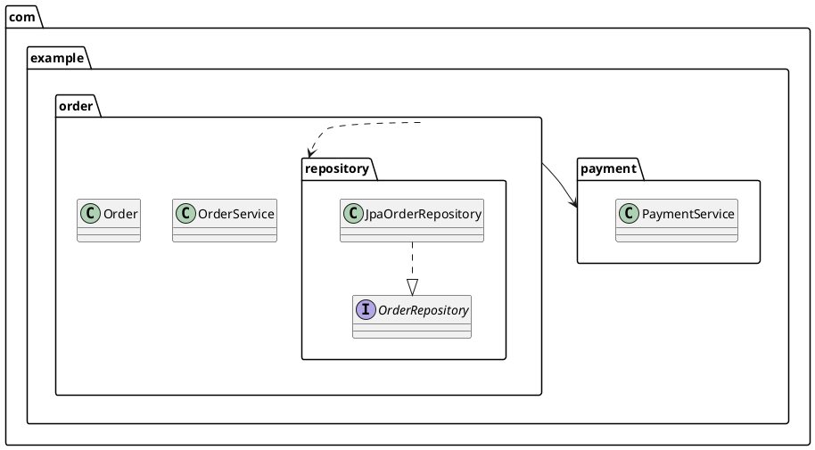
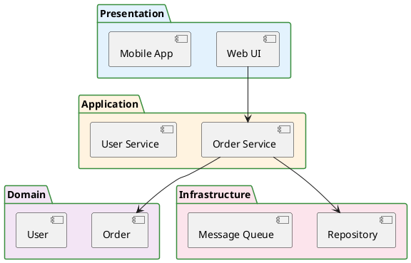
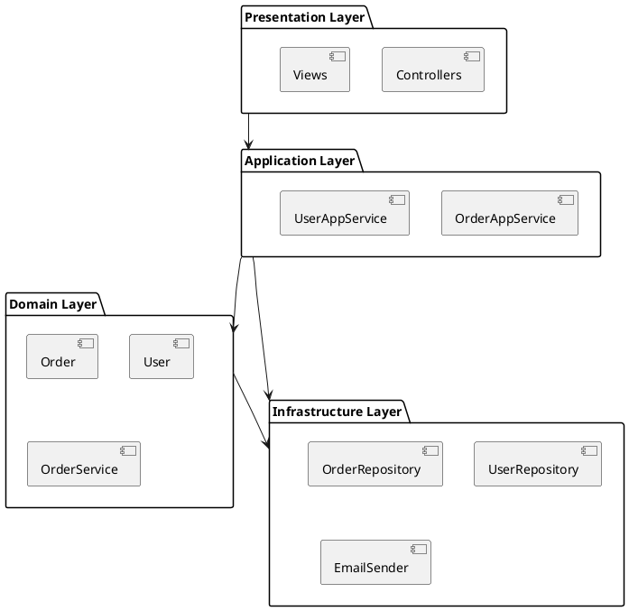
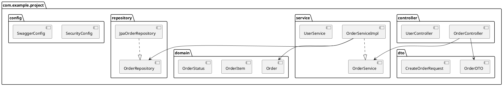
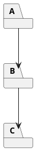

# 如何画包图 (Package Diagram)

> 包图用于将模型元素分组并展示它们之间的依赖关系，是大型系统架构设计中组织层次结构的核心工具。

## 包图的用途

包图回答的是"系统的模块如何组织，它们之间有什么依赖关系"：
- 将大型系统划分为逻辑上内聚的模块（包/命名空间）
- 展示模块之间的依赖方向和耦合程度
- 帮助识别循环依赖和架构异味
- 为分层架构、领域驱动设计（DDD）的有界上下文提供可视化
- 组织类图的宏观结构，避免单张类图包含过多元素

## 关键元素

| 元素 | PlantUML 表示 | 说明 |
|------|-------------|------|
| **包 (Package)** | `package "名称" {}` | 逻辑分组容器，可嵌套 |
| **命名空间** | `package 名称 {}` | 用 `.` 分隔层次，如 `com.example.order` |
| **依赖 (Dependency)** | `A --> B` 或 `A ..> B` | 包 A 依赖包 B（变更会传播） |
| **包含/嵌套** | 大括号嵌套 | 子包属于父包 |

## PlantUML 语法

### 基本包定义



### 命名空间风格（Java 包结构）



### 带颜色和样式的包图



## 常见架构模式

### 分层架构（Layered Architecture）

```
Presentation  →  Application  →  Domain  →  Infrastructure
（上层依赖下层，下层不依赖上层）
```



### 领域驱动设计 (DDD) 有界上下文

```plantuml
@startuml
package "Order Context" as Order {
  [Order] as O
  [OrderItem]
  [OrderService]
}

package "Payment Context" as Payment {
  [Payment]
  [PaymentGateway]
}

package "Shipping Context" as Shipping {
  [Shipment]
  [TrackingService]
}

package "Shared Kernel" as Shared {
  [Money]
  [Address]
  [UserId]
}

Order --> Payment : depends on
Order --> Shipping
Order --> Shared
Payment --> Shared
Shipping --> Shared
@enduml
```

### Java 典型项目包结构



## 包间依赖原则

好的包结构应该遵循以下原则：

### 无环依赖原则 (Acyclic Dependencies Principle)
包之间的依赖关系图中不应存在循环。如果 A→B→C→A 形成循环，这些包必须作为一个整体一起发布和测试。



### 稳定依赖原则 (Stable Dependencies Principle)
依赖方向应指向更稳定的包。被依赖越多的包越稳定（不易变更），依赖别人的包应保持灵活。

### 稳定抽象原则 (Stable Abstractions Principle)
稳定程度越高的包抽象程度越高。抽象（接口、抽象类）应该放在稳定的包中，具体实现放在灵活的包中。

## 包图建模步骤

1. **确定顶层包**：按架构层（Presentation/Application/Domain/Infrastructure）或按业务域划分
2. **逐层展开子包**：每个顶层包内是否需要进一步细分
3. **标注依赖方向**：从依赖方指向被依赖方，确保无循环
4. **检查依赖合理性**：上层能依赖下层，下层不应依赖上层；域层不应依赖基础设施层（依赖倒置）
5. **标注关键类/接口**：在包内放置代表性元素说明包的职责

## 最佳实践

- **控制包的大小**：一个包内的类应在 10-20 个以内，超过则拆分子包
- **高内聚低耦合**：包内元素应紧密相关，包间耦合应尽可能小
- **依赖方向与架构层次一致**：依赖箭头应指向更稳定、更抽象的包
- **避免循环依赖**：如果发现循环依赖，提取公共接口或拆分包
- **使用分层命名**：`com.example.order.controller` 比 `controllers` 更清晰
- **包图配合类图使用**：包图给出宏观结构，类图给出微观设计

## 包图与组件图的区别

| 维度 | 包图 | 组件图 |
|------|------|-------|
| 关注点 | 代码的组织结构（命名空间、模块） | 运行时的组件/服务结构 |
| 粒度 | 包/模块层级 | 可独立部署的服务/组件 |
| 典型元素 | package、class | component、interface、database |
| 受众 | 开发者 | 架构师、开发者 |
| 典型问题 | "OrderService 应该放在哪个包？" | "Order Service 依赖哪些其他服务？" |
