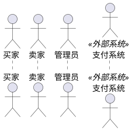
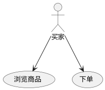
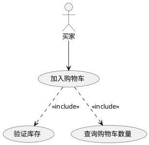
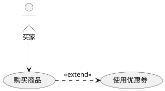
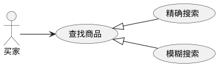
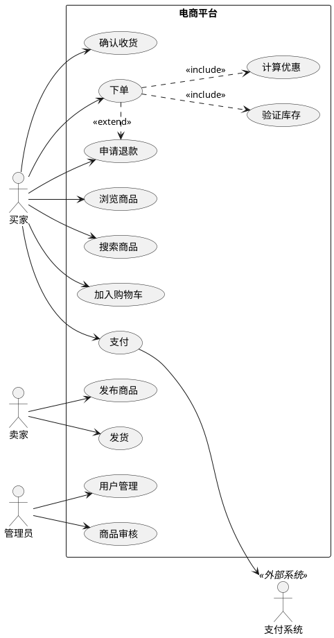
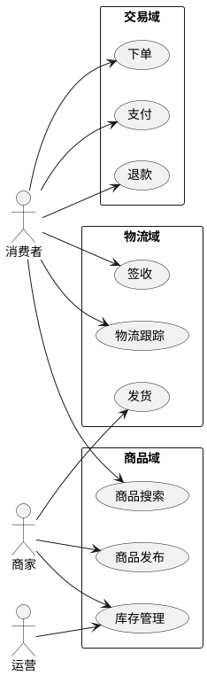

# 如何画用例图 (Use Case Diagram)

> 用例图从用户视角描述系统的功能需求，展示系统"做什么"而非"怎么做"。是软件需求分析到最终交付的第一步。

## 用例图的用途

用例图回答的是"系统为哪些用户提供什么功能"：
- 捕捉系统的功能需求和用户使用场景
- 界定系统边界，区分系统内部和外部
- 为需求评审提供可视化蓝图（与利益相关者沟通）
- 驱动后续分析和设计（作为时序图、类图的输入）
- 为测试设计提供依据（基于用例编写验收测试）

## 关键元素

### 参与者 (Actor)

参与者也叫角色，表示系统用户的集合——不是具体用户，而是用户在系统中扮演的角色。



**参与者不一定是人**：
- 人类用户：买家、卖家、管理员
- 外部系统：支付网关、短信服务
- 硬件设备：传感器、打印机
- 定时任务：每日结算任务

### 用例 (Use Case)

用例描述参与者使用系统达成的具体目标，用椭圆形表示。

用例的特征：
- 从系统外部可见的功能（不考虑内部实现）
- 对应一个具体的用户目标（不是功能步骤）
- 由参与者发起，执行结果返回给参与者
- 功能上具有完整性（有输入、有输出）

### 系统边界 (System Boundary)

用矩形框界定系统范围，用例在框内，参与者在框外。

## 四种关系

### 关联 (Association) — 参与者与用例的交互



**PlantUML**：`participant --> (usecase)`

### 包含 (Include) — 必须执行的子功能

基本用例的行为必定包含被包含用例。用 `<<include>>` 标注，虚线箭头从基本用例指向包含用例。



**使用场景**：多个用例共享同一段行为时提取出来。

### 扩展 (Extend) — 可选的条件性行为

基本用例本身是完整的，扩展用例在特定条件下才插入执行。用 `<<extend>>` 标注，虚线箭头从扩展用例指向基本用例（注意方向：与 include 相反！）。



**使用场景**：表示可选功能或特定条件下的分支行为。

### 泛化 (Generalization) — 用例/参与者的继承

多个用例共享相似结构和行为时，抽象出父用例。



## 四种关系对比

| 关系 | 特点 | 箭头方向 | 使用场景 |
|------|------|---------|---------|
| **关联** | 参与者和用例的基本交互 | actor → 用例 | 所有参与者-用例交互 |
| **包含** | 必选，基本用例执行时必须执行 | 基本用例 → 包含用例 (..>) | 共享/复用的子功能 |
| **扩展** | 可选，基础用例可独立运行 | 扩展用例 → 基本用例 (.>) | 可选功能、条件分支 |
| **泛化** | 继承，子用例是父用例的特化 | 子用例 → 父用例 (<|--) | 行为变型 |

## 完整 PlantUML 示例

### 电商系统用例图



### 域划分中的用例分析

在架构设计中，通过用例图按业务域分组，识别各域的功能职责：



## 如何识别参与者和用例

### 识别参与者

通过与客户沟通时询问以下问题：
1. 谁将使用系统的主要功能？
2. 谁需要系统的支持以完成日常工作？
3. 谁负责维护、管理系统并保持系统正常运行？
4. 系统需要与哪些外部系统交互？
5. 系统需要处理哪些硬件设备？
6. 谁对系统运行产生的结果比较感兴趣？

### 识别用例

通过参与者反推用例：
1. 每个参与者执行的操作有什么？
2. 参与者要向系统请求什么功能？
3. 什么参与者将要创建、存储、改变、删除或读取系统中的信息？
4. 参与者需要通知外部系统的突然变化吗？
5. 系统需要通知参与者正在发生的事情吗？

### 约束

- **每个用例至少有一个参与者**——没有参与者的用例考虑并入其他用例
- **每个参与者至少一个用例**——没有用例的参与者考虑其是否多余

## 用例描述模板

重要用例需要配合文本描述：

```
用例名称：[名称]
用例编号：UC-XXX
参与者：[参与者列表]
前置条件：[执行前必须满足的条件]
后置条件：[执行完成后的系统状态]
基本流程：
  1. [步骤1]
  2. [步骤2]
  ...
备选流程：
  2a. [备选步骤]
异常流程：
  3a. [异常处理]
```

## 用例驱动的开发流程

用例图不仅是文档，更驱动整个开发过程：

```
需求阶段 → 通过用例图捕获功能需求，确定系统边界
分析阶段 → 为每个用例编写详细描述，识别域对象
设计阶段 → 将用例实现为类的协作（用时序图和类图）
实现阶段 → 基于设计模型编写代码
测试阶段 → 基于用例编写测试用例
```

## 最佳实践

- **用例粒度要适当**：不宜过大（难以理解）或过小（碎片化）。一个用例对应一个用户的具体目标
- **从用户视角出发**：用例是用户能感知到的功能，不是系统的内部步骤
- **避免功能分解**：用例图不是功能分解图，不要把"下单"拆成"填写地址→选择支付→确认"
- **系统边界要明确**：用矩形框界定范围，外部参与者放框外
- **先画主要用例**：从核心业务功能开始，逐步补充
- **当用例数量多时使用包分组**：按业务域或子系统分组
- **Include 用于复用**：多个用例共享的子功能提取为 Include
- **Extend 用于可选**：有条件触发的可选功能用 Extend
- **泛化用于变型**：多个相似但不同的用例用泛化抽象
