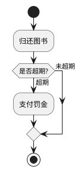
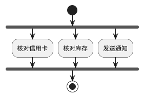
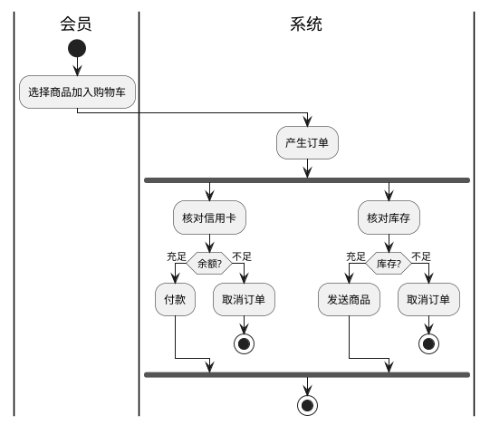
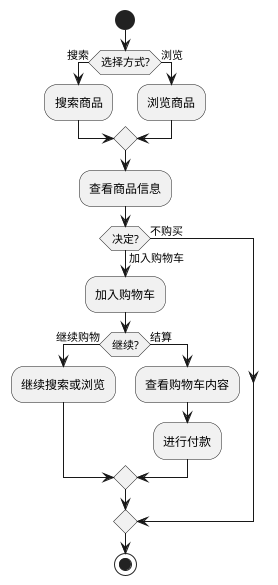
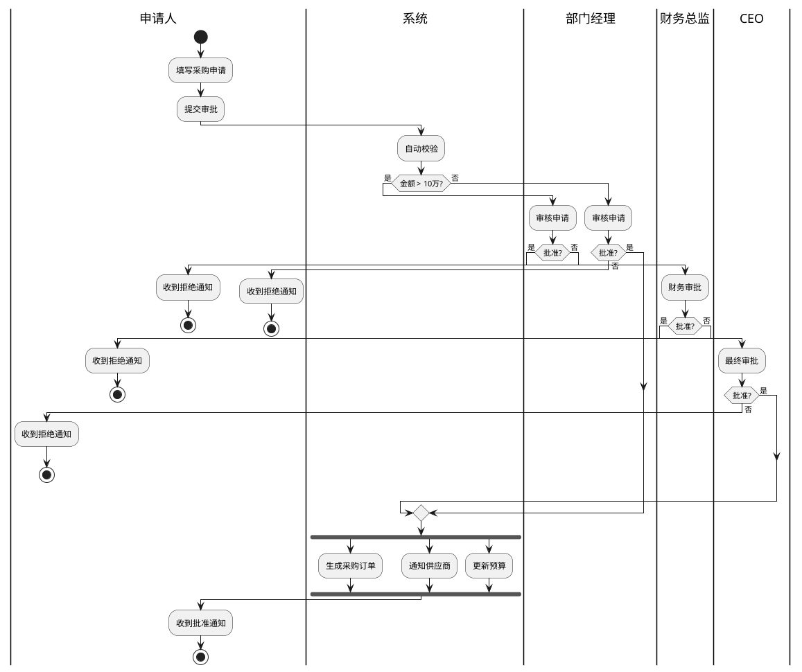
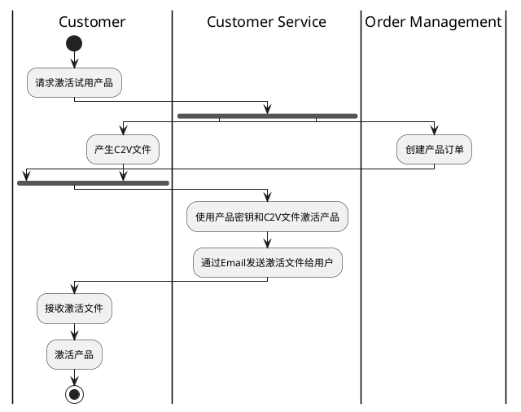

# 如何画活动图 (Activity Diagram)

> 活动图展示业务流程、工作流或算法的控制流和数据流。它是增强版流程图，支持并发处理和泳道分区，是业务建模和流程设计的核心工具。

## 活动图的用途

活动图回答的是"完成一个业务流程，经过哪些步骤，由谁负责，有什么条件分支"：
- 描述复杂业务流程（审批、订单处理）
- 细化用例图中的用例内部步骤
- 设计并发/多线程处理逻辑
- 工作流引擎的可视化设计
- 算法逻辑的可视化表达

## 关键元素

### 基础元素

| 元素 | PlantUML 语法 | 说明 |
|------|-------------|------|
| 开始节点 | `start` | 黑色实心圆，流程唯一入口 |
| 结束节点 | `stop` | 双环圆，流程终点（可有多个） |
| 活动/动作 | `:动作描述;` | 圆角矩形，单个步骤 |
| 控制流 | `->` | 实线箭头，连接活动之间的执行顺序 |
| 对象流 | `-[dashed]->` | 虚线箭头，表示数据传递 |

### 条件分支（决策/合并）

- **决策 (Decision)**：菱形，条件判断分支
- **合并 (Merge)**：菱形，多个分支汇聚到同一点

### 分叉与汇合（并发）

- **分叉 (Fork)**：粗横线，一个控制流分裂为多个并发分支
- **汇合 (Join)**：粗横线，多个并发分支同步后合并为一条控制流

**分叉与决策的区别**：
- 分叉：所有分支**同时执行**，汇合时**等待所有分支完成**
- 决策：只走**一条分支**，合并时**任意分支到达即继续**

### 泳道 (Swimlane)

将活动按执行者（角色、系统）分组，明确职责：

泳道用 `|泳道名|` 声明，之后的动作都属于该泳道，直到下一个泳道声明。泳道之间可以任意切换。

## 完整 PlantUML 示例

### 网上购物流程

### 多角色审批流程

### 产品激活流程（含泳道+并发）

## 活动图与流程图的区别

| 类型 | 说明 |
|------|------|
| **基础流程图** | 直观描述工作过程的步骤图，使用图形表示流程思路 |
| **活动图** | UML 规范中的进阶流程图，**支持并发、泳道**等高级特性 |
| **泳道图** | 带泳道的流程图，表述多角色业务流程 |
| **任务流程图** | 无泳道的流程图，表述单一角色的任务步骤 |

活动图相比普通流程图的优势：支持并发建模，是多线程编程的很好工具。

## 活动图建模步骤

1. **确定流程的起点和终点**：流程从哪开始？到哪结束？（可能有多个终点）
2. **列出所有步骤**：完成这个业务流程需要哪些动作？
3. **识别条件分支**：哪些步骤需要判断条件？可能的路径有哪些？
4. **识别并行活动**：哪些步骤可以同时进行？
5. **分配执行者（泳道）**：每个步骤由哪个角色/系统负责？
6. **检查完整性**：所有路径是否都到达了终点？有没有死循环或死锁？

## 最佳实践

- **泳道划分职责**：当涉及多个参与者时，必须使用泳道明确"谁做什么"
- **分叉/汇合表达并行**：凡是能同时进行的操作，用 fork 表达
- **决策节点标注清晰的条件**：`if (条件?) then (是) ... else (否)` 格式
- **避免超过 3 层嵌套**：深层嵌套难以理解，考虑拆分为子活动图
- **每个活动应是有意义的完整操作**：不要把"获取用户名"当作一个活动（粒度太小）
- **标注关键数据流转**：使用对象流（虚线箭头）标注关键的数据传递
- **活动图通常配合用例图使用**：一个用例对应一张活动图，描述用例的详细步骤

## 常见误区

| 误区 | 正确做法 |
|------|---------|
| 混淆决策和分叉 | 决策 = 走一条路（if-else）；分叉 = 同时走多条路（并行） |
| 泳道切割过细 | 通常按角色/系统划分子泳道，不要为每个类建泳道 |
| 没有标注结束节点 | 每个分支路径都应到达一个 stop 或汇入主流程 |
| 活动粒度过细/过粗 | "登录"是好粒度；"输入用户名"太细；"完成交易"太粗 |
| 活动图替代时序图 | 活动图展示流程步骤和职责，时序图展示对象间消息交互——两者互补 |
