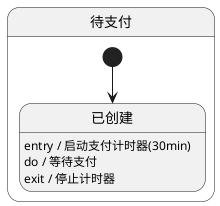
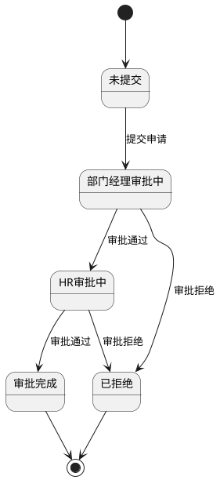
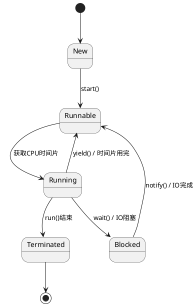
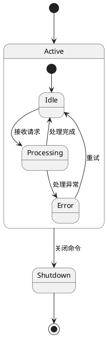
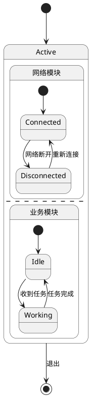
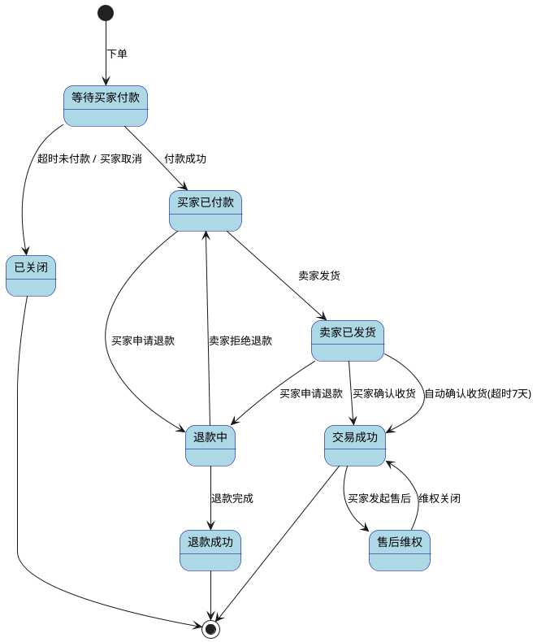
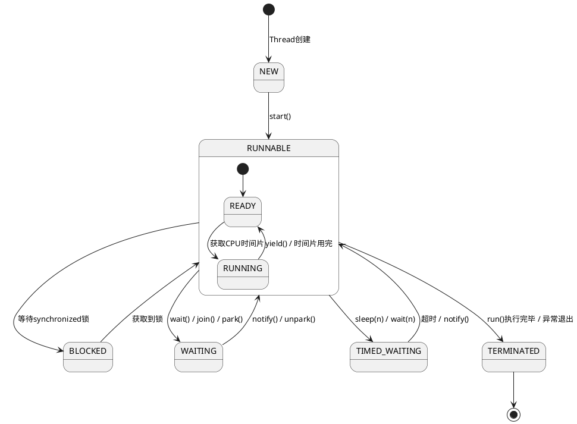

# 如何画状态机图 (State Machine Diagram)

> 状态机图描述单个对象在其生命周期中响应事件所经历的状态序列，展示对象"有哪些状态，在什么条件下如何变化"。是订单系统、审批流程、协议设计等场景的核心建模工具。

## 状态机图的用途

状态机图回答的是"这个对象有哪些状态，什么事件触发状态变化，变化时做什么"：
- 消除复杂的 if-else/switch 状态判断逻辑
- 为订单、审批、工单等有明确生命周期的对象建模
- 设计通信协议的状态握手和传输过程
- UI 组件状态设计（按钮的 enabled/disabled/loading）
- 工作流引擎的状态流转规则

## 核心概念

### 有限状态机（FSM）五要素

| 要素 | PlantUML 语法 | 说明 |
|------|-------------|------|
| **状态 (State)** | `state 状态名` 或直接写状态名 | 对象在某个时刻的条件 |
| **事件 (Event)** | 箭头上的文本 | 触发状态转换的外部/内部刺激 |
| **转换 (Transition)** | `-->` | 从一个状态到另一个状态的变化 |
| **守卫条件 (Guard)** | `[条件]` | 转换发生的前置条件 |
| **动作 (Action)** | `/动作` | 转换时执行的操作 |

完整转换语法：`状态A --> 状态B : 事件 [守卫条件] / 动作`

### 状态类型

| 类型 | 表示 | 说明 |
|------|------|------|
| 初始状态 | `[*]` | 黑色实心圆，状态机的唯一入口 |
| 终止状态 | `[*]` | 双环圆，状态机结束（可有多个） |
| 简单状态 | 圆角矩形 | 没有子状态的基本状态 |
| 组合状态 | 包含子状态的大状态 | 层次化组织相关状态 |
| 并发状态 | `--` 分隔的并行区域 | 多个子状态机同时运行 |

### 状态内部行为



- **entry**：进入状态时执行的动作
- **do**：在状态驻留期间持续执行的活动
- **exit**：离开状态时执行的动作

## PlantUML 语法

### 基本状态机



### 含守卫条件的状态机



### 组合状态（层次化）



### 并发状态（正交区域）

两个独立的子状态机同时运行，用 `--` 分隔：



## 完整 PlantUML 示例

### 订单状态机（经典案例）



### Java 线程状态机



## 状态机图的编程实现

### 方式一：枚举状态机（简单场景）

```java
public enum State {
    PENDING {
        @Override
        State transition(String event) {
            if ("PAY".equals(event)) return PAID;
            if ("CANCEL".equals(event)) return CANCELLED;
            return this; // 保持当前状态
        }
    },
    PAID {
        @Override
        State transition(String event) {
            if ("SHIP".equals(event)) return SHIPPED;
            if ("REFUND".equals(event)) return REFUNDING;
            return this;
        }
    },
    // ...
    ;
    abstract State transition(String event);
}
```

### 方式二：状态模式（GoF 设计模式）

将每个状态封装为独立类，符合开闭原则，类数量随状态增长。

### 方式三：COLA StateMachine（推荐）

阿里开源的轻量级状态机框架：

```java
StateMachineBuilder<States, Events, Context> builder =
    StateMachineBuilderFactory.create();

builder.externalTransition()
    .from(States.PENDING)
    .to(States.PAID)
    .on(Events.PAY_SUCCESS)
    .when(checkBalance())
    .perform(createPayment());

StateMachine<States, Events, Context> machine = builder.build("order");
States target = machine.fireEvent(States.PENDING, Events.PAY_SUCCESS, context);
```

## 状态机图建模步骤

1. **确定建模对象**：哪些对象有复杂的生命周期？（订单、审批、连接、工单）
2. **列举所有状态**：穷尽对象可能处于的所有关键状态
3. **识别初始和终止状态**：对象的起点在哪？哪些是终点？
4. **定义转换路径**：每个状态在什么事件下切换到哪个状态
5. **添加守卫条件**：同一事件在不同条件下是否走向不同状态？
6. **标注动作**：状态转换时或状态驻留时需要执行什么动作？
7. **检查完整性**：所有状态是否都能从初始状态到达？是否都能到达终止状态？有没有死锁？

## 最佳实践

- **只对有复杂生命周期的对象建模**：简单 CRUD 对象不需要状态机（如"已读/未读"用 boolean 就够了）
- **状态要穷尽**：覆盖对象的所有可能状态，包括异常状态
- **转换要有明确的触发事件**：每个箭头都要标注是什么事件触发了这次转换
- **使用守卫条件而非拆分状态**：同事件不同结果用 `[条件]`，而非创建多个几乎相同的状态
- **使用组合状态避免状态爆炸**：当子状态过多时将相关状态封装为组合状态
- **验证终止性**：确保不存在死锁（无法到达终止状态）和活锁（无限循环）
- **区分 Entry/Do/Exit**：进入时初始化、驻留时持续监控、离开时清理
- **事件要幂等**：同一事件多次触发，状态机行为应保持一致

## 状态机图与活动图的区别

| 维度 | 状态机图 | 活动图 |
|------|---------|--------|
| 关注点 | 一个对象的**状态变化** | 一个业务流程的**步骤顺序** |
| 核心元素 | 状态（State）、转换（Transition） | 活动（Action）、控制流 |
| 驱动方式 | 事件驱动（被动等待事件） | 流程驱动（步骤自动推进） |
| 典型问题 | "订单支付后变成什么状态？" | "下单流程需要经过哪些步骤？" |
| 受众 | 开发者、领域专家 | 业务分析师、产品经理 |
