# 如何画甘特图 (Gantt Diagram)

> 甘特图以时间为横轴、任务为纵轴，直观展示项目中各任务的开始时间、持续时长、依赖关系与进度。是项目排期、里程碑管理、交付计划可视化的核心工具，回答"什么时候做什么、谁依赖谁、现在进展如何"。

## 甘特图的用途

甘特图关注的是"任务在时间线上如何分布、如何相互制约、完成到什么程度"：
- 制定项目排期计划（设计/开发/测试/上线的时间安排）
- 表达任务之间的先后依赖（B 必须等 A 完成才能开始）
- 标注关键里程碑（评审通过、版本发布、验收节点）
- 跟踪任务完成进度（已完成百分比、今日标记）
- 管理工作日历（周末、节假日、停工日不计入工期）
- 输出对外沟通用的甘特排期图（配合颜色区分阶段/状态）

> 甘特图使用 `@startgantt ... @endgantt` 包裹，是 PlantUML 的专用图类型，**不需要 Graphviz/dot**，纯离线即可渲染。

## 核心概念

### 甘特图五要素

| 要素 | PlantUML 语法 | 说明 |
|------|-------------|------|
| **任务 (Task)** | `[任务名] requires N days` | 一段有起止的工作，横条表示 |
| **工期 (Duration)** | `requires/lasts N days` / `N weeks` | 任务持续的时间长度 |
| **依赖 (Dependency)** | `[B] starts at [A]'s end` | 任务之间的时间约束 |
| **里程碑 (Milestone)** | `[M] happens at [T]'s end` | 无工期的时间点，菱形表示 |
| **分隔符 (Separator)** | `-- 标题 --` | 分组任务的水平分隔行 |

### 时间与工期单位

工期以 `requires` 或等价的 `lasts`/`requires` 声明，单位支持 `day`、`week`、`month`（1 月按 30 天计）：

```plantuml
@startgantt
[单日任务] requires 1 day
[五天任务] requires 5 days
[一周任务] lasts 1 week
[一周零四天] requires 1 week and 4 days
[两周任务] requires 2 weeks
[一个月任务] lasts 1 month
@endgantt
```

> `requires`、`lasts`、`needs` 是等价动词，可互换。工期数字为 1 时用单数 `day`/`week`，大于 1 用复数，PlantUML 都能识别。

### 项目起点与绝对/相对定位

- **项目起点**：`Project starts YYYY-MM-DD`，定义整个甘特图的时间基准，此后可用 `D+N` 相对天数。
- **绝对日期**：`[任务] starts YYYY-MM-DD` / `[任务] ends YYYY-MM-DD`。
- **相对偏移**：`starts D+0`、`starts D+15`（相对项目起点第 N 天）。

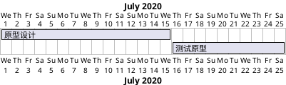

## PlantUML 语法

### 声明任务的三种方式

```plantuml
@startgantt
' 方式一：只声明工期，任务自动从项目起点排列
[任务A] requires 10 days

' 方式二：绝对日期 + 工期（单行 and 连接）
[任务B] starts 2020-07-16 and requires 10 days

' 方式三：绝对起止（单行 and 连接）
[任务C] starts 2020-07-01 and ends 2020-07-15
@endgantt
```

### 任务依赖（约束条件）

依赖是甘特图的灵魂。常用形式：

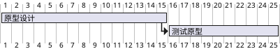

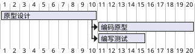

支持带偏移量的依赖，以及箭头连线：

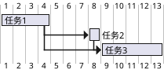

> `then [任务]` 是"紧接上一任务结束后开始"的简写；`[A] -> [B]` 会画出一条依赖箭头。

### 短名称（别名）

任务名较长时用 `as [别名]` 简化后续引用：


### 里程碑

里程碑是没有工期的时间点，用 `happens` 声明，渲染为菱形：

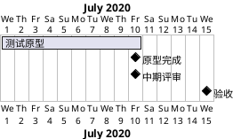

### 完成进度

用 `is N% complete`（或 `completed`）标注任务已完成比例，横条按比例填充：

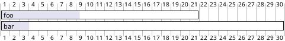

### 自定义颜色

`is colored in 前景色/边框色`（斜线后为边框，可省略只写一种）：

```plantuml
@startgantt
[原型设计] requires 13 days
[测试原型] requires 4 days
[测试原型] starts at [原型设计]'s end
[原型设计] is colored in Fuchsia/FireBrick
[测试原型] is colored in GreenYellow/Green
@endgantt
```

也可以在单行声明中一次写全（颜色 + 工期 + 依赖）：

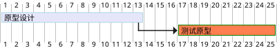

### 水平分隔符（分组）

`-- 标题 --` 在任务之间插入一条带标题的分隔行，用于按阶段分组：

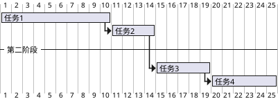

### 工作日历：周末与停工日

默认所有天都计入工期。声明关闭日后，任务横条会自动跳过这些天：

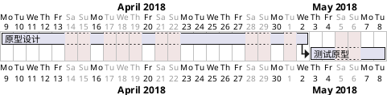

- `saturday are closed` / `sunday are closed`：关闭固定星期几。
- `YYYY-MM-DD is closed`：关闭单个日期（如法定假日）。
- `YYYY-MM-DD to YYYY-MM-DD is closed`：关闭一段区间。
- `YYYY-MM-DD is open`：在已关闭区间中重新开放某天。
- `[任务] pauses on 2018/12/13` / `pauses on monday`：让单个任务在某天暂停。

### 今日标记

`today` 关键字画出"今天"的竖线，可定位并着色：

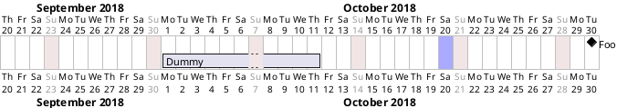

- `today is N days after start`：相对项目起点定位今天。
- `today is colored in #AAF`：设置今日竖线颜色。

### 时间刻度（printscale）

默认按天（daily）绘制横轴。项目周期长时改用更粗的刻度避免图过宽：

```plantuml
@startgantt
printscale weekly
Project starts 2021-01-01
saturday are closed
sunday are closed
[原型设计] as [TASK1] requires 19 days
[TASK1] is colored in Lavender/LightBlue
[测试] requires 14 days
[TASK1] -> [测试]
@endgantt
```

| 刻度 | 语法 | 适用周期 |
|------|------|---------|
| 每天 | `printscale daily`（默认） | 数天到 2~3 周 |
| 每周 | `printscale weekly` | 1~4 个月 |
| 每月 | `projectscale monthly` | 半年到 1 年 |
| 每季 | `projectscale quarterly` | 1~3 年 |
| 每年 | `projectscale yearly` | 多年期 |

- 还可加缩放系数拉伸格宽：`printscale daily zoom 2`、`projectscale monthly zoom 3`。
- 周刻度可切换显示方式：`printscale weekly with calendar date`（显示日历日期而非周号）、`printscale weekly with week numbering from 1`（自定义起始周号）。

### 着色日与命名区间

给特定日期或区间上色、命名，常用于标注封版期、假期、评审周：

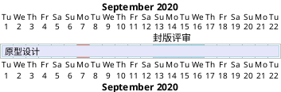

### 超链接

任务可挂接跳转链接（SVG 中可点击）：

```plantuml
@startgantt
[task1] requires 10 days
[task1] links to [[http://plantuml.com]]
@endgantt
```

### 资源与分配（可选）

用 `on {资源名}` 给任务分配资源，可设占比；用 `hide resources` 隐藏底部资源盒：

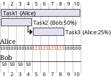

```plantuml
@startgantt
hide resources names
hide resources footbox
[Task1] on {Alice} requires 10 days
[Task2] on {Bob:50%} requires 2 days
@endgantt
```

- `{Alice} is off on 2020-06-24 to 2020-06-26`：设置资源休假。
- `hide footbox`：隐藏底部日期脚盒，让图更紧凑。

### 标题、图例与注释

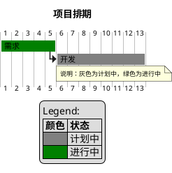

## 完整 PlantUML 示例

### 多阶段软件交付计划（经典案例）

一个包含设计/开发/测试/上线四阶段、含依赖、里程碑、颜色、完成进度、今日标记与分隔符的完整排期：

```plantuml
@startgantt
printscale weekly
Project starts 2026-03-02
saturday are closed
sunday are closed

today is 35 days after start and is colored in #AAD4FF

-- 设计阶段 --
[需求分析] as [REQ] requires 8 days
[REQ] is 100% complete
[REQ] is colored in GreenYellow/Green
[架构设计] as [ARCH] starts at [REQ]'s end and requires 10 days
[ARCH] is 100% complete
[ARCH] is colored in GreenYellow/Green
[设计评审通过] as [M1] happens at [ARCH]'s end

-- 开发阶段 --
[后端开发] as [BE] starts at [ARCH]'s end and requires 20 days
[BE] is 60% complete
[BE] is colored in Lavender/RoyalBlue
[前端开发] as [FE] starts at [ARCH]'s end and requires 18 days
[FE] is 55% complete
[FE] is colored in Lavender/RoyalBlue
[联调对接] as [INT] starts 2 days after [BE]'s end and requires 6 days
[INT] is colored in Lavender/RoyalBlue

-- 测试阶段 --
[系统测试] as [QA] starts at [INT]'s end and requires 12 days
[QA] is colored in Moccasin/DarkOrange
[缺陷修复] as [FIX] starts 3 days after [QA]'s start and requires 10 days
[FIX] is colored in Moccasin/DarkOrange
[测试通过] as [M2] happens at [QA]'s end

-- 上线阶段 --
[预发布部署] as [STG] starts at [QA]'s end and requires 4 days
[STG] is colored in Pink/Crimson
[生产上线] as [PROD] starts at [STG]'s end and requires 2 days
[PROD] is colored in Pink/Crimson
[正式发布] as [M3] happens at [PROD]'s end

[BE] -> [INT]
[FE] -> [INT]
@endgantt
```

### 含关闭日的短周期排期（daily 刻度）

```plantuml
@startgantt
project starts the 2026/04/06
saturday are closed
sunday are closed
2026/05/01 is closed

[原型设计] requires 9 days
[测试原型] requires 5 days
[测试原型] starts at [原型设计]'s end
[原型设计] is colored in Fuchsia/FireBrick
[测试原型] is colored in GreenYellow/Green
[原型验收] happens at [测试原型]'s end
@endgantt
```

## 最佳实践

- **先定基准再排任务**：开头写 `Project starts ...`，让所有相对日期和 `today` 有参照。
- **优先用依赖而非硬编码日期**：`starts at [A]'s end` 比写死 `starts 2026-05-01` 更健壮——上游任务改期时下游自动顺延。
- **别名简化长任务名**：`[后端接口开发] as [BE]` 后续引用只写 `[BE]`，避免重复长串中文出错。
- **用里程碑锁定关键节点**：评审通过、版本发布等"点事件"用 `happens`，不要用零工期任务代替。
- **进度用完成百分比表达**：`is 60% complete` 让横条按比例填充，配合 `today` 一眼看出是否延期。
- **配置真实工作日历**：声明 `saturday/sunday are closed` 和法定假日 `is closed`，工期估算才准确。
- **刻度匹配周期**：几天用 daily，几个月用 weekly，跨年用 monthly/quarterly，避免图过宽或过挤。
- **颜色编码语义化**：按阶段或状态统一配色（如已完成=绿、进行中=蓝、测试=橙），并配 `legend` 说明。
- **善用注释**：`' 单行注释` 和 `/' 多行注释 '/` 记录排期假设，便于维护。

## 布局与美观技巧

甘特图的"布局"主要是时间维度的组织与视觉分组，核心手段如下：

- **用分隔符分组阶段**：每个阶段前加 `-- 阶段名 --`，把设计/开发/测试/上线在视觉上切分成区块，比单纯罗列任务清晰得多。
- **按阶段/状态颜色编码**：同阶段任务用同一色系（设计=GreenYellow、开发=Lavender/RoyalBlue、测试=Moccasin/DarkOrange、上线=Pink/Crimson），读者扫一眼就能定位阶段。已完成任务用绿色、风险任务用红色，形成状态语义。
- **里程碑锚定关键日期**：在阶段交界处放里程碑（`[评审通过] happens at [X]'s end`），菱形节点天然吸引视线，充当"检查点"。
- **选对 printscale 适配时间跨度**：
  - 周期 ≤ 3 周 → `printscale daily`，能看到每一天；
  - 1~4 个月 → `printscale weekly`，横轴按周压缩，图宽适中（本文交付计划即用此刻度）；
  - 半年以上 → `projectscale monthly`；跨年 → `quarterly`/`yearly`。
  - 若单格太窄看不清，追加 `zoom N` 拉伸。
- **今日线定位进度**：`today is N days after start and is colored in #AAD4FF` 画一条醒目竖线，与完成百分比配合，直观呈现"计划 vs 实际"。
- **关闭非工作日避免误导**：周末/假日横条自动跳过，工期条长度反映真实投入天数。
- **需要更紧凑时隐藏脚盒**：`hide footbox`（及 `hide resources footbox`）去掉底部日期/资源盒，适合嵌入文档的缩略排期。
- **长跨度改用 SVG 输出**：甘特图横向可能很宽，PNG 有 4096px 上限；宽图优先看 SVG（矢量、可缩放、链接可点）。
- **用 `<style>` 统一主题、抑制视觉噪声**：默认周末/关闭日会画成醒目的红棕竖条，任务多时背景会显得杂乱。在 `<style> ganttDiagram { ... } </style>` 里把 `closed { BackgroundColor #F7F7F7 }` 调到几乎与背景同色、`timeline { BackgroundColor #FCFCFC }` 给横轴一层极淡底色，图面立刻干净。可选样式块：`task`（字号/字色/线宽）、`milestone`、`separator`、`note`、`arrow`。样式集中声明，比逐条 `is colored in` 更一致、更好维护。
- **周末闭合列务必调到接近背景色**：周末/停工日会画成跨越所有泳道的竖条。若用醒目灰（如 `#F0F0F0`）会在全图形成密集条纹、削弱任务条层次；改用极浅的 `closed { BackgroundColor #F7F7F7 }` 让竖条几乎隐形，任务条重新成为唯一焦点。
- **把分隔符做成分组带**：给 `separator { BackgroundColor #ECEFF1 LineColor #B0BEC5 FontStyle bold Margin 4 Padding 4 }`，每个 `-- 阶段名 --` 会渲染成一条浅色横带，阶段边界一目了然，替代单薄的分隔线。
- **里程碑统一高亮**：用 `milestone { BackGroundColor #FFD54F LineColor #F57F17 FontStyle bold }` 让所有 `happens` 菱形统一成醒目黄色，作为跨阶段"检查点"锚点，并在 `legend` 里为其单列一行说明。
- **命名着色区间标注特殊窗口，且色相要与相邻任务条拉开**：`YYYY-MM-DD to YYYY-MM-DD are colored in #80DEEA` + `... are named [封版窗口]` 可在时间轴上高亮封版期/评审周/冻结期，为排期增加语义层次。**着色窗口是一条贯穿全高的竖带，务必选与其所在区域任务条色相差异大的颜色**——若窗口落在测试阶段（Moccasin 暖橙）附近，就用淡青/淡紫等冷色（`#80DEEA`/`#B39DDB`）而非同为暖橙的 `#FFE0B2`，否则竖带与任务条糊成一片、区分度低。注意区间应落在项目可见时间范围内，避免被裁掉。
- **今日线要足够饱和才可见**：`today is N days after start and is colored in #1565C0`（饱和深蓝）能画出清晰可辨的当前时间竖线。过浅的天蓝（如 `#4FC3F7`）在白底上几乎不可见——声明了却看不到，等于没画；宁可选饱和对比色，确保这条"计划 vs 实际"的基准线一眼可辨。
- **完成度覆盖各阶段更真实**：让进行中的任务带上 `is N% complete`（如联调 `is 20% complete`），横条按比例填充，配合今日线一眼看出"计划 vs 实际"的偏差，也让图面信息密度更均衡。
- **配色控制在 4~5 个色系内**：每阶段一个主色系（设计=GreenYellow、开发=Lavender/RoyalBlue、测试=Moccasin/DarkOrange、上线=Pink/Crimson），色相区分清晰又不刺眼；避免每个任务各用一色导致花乱。

### 尺寸、清晰度与留白（重点）

甘特图默认字号偏小、横条偏细，任务多时容易显得局促、文字发糊。下面这组手段能让成图"大而清晰、留白得当、重心均衡"：

- **统一放大字号**：在 `<style>` 里给 `task`、`milestone`、`separator`、`timeline`、`note` 分别设 `FontSize`（如任务 16、分隔符 17、里程碑 16、刻度 15、注释 14）。字号变大后行高随之增加，任务条之间自然有了行距/呼吸感，中文标签也不再发糊。
- **给横条加粗描边**：`task { LineThickness 1.5 }` 让每根任务条边界清晰，比默认 1px 更有质感、更易区分相邻行。
- **分隔符 `Margin`/`Padding` 宜收紧，避免泳道内大片垂直空白**：`separator { Margin 3 Padding 4 }`（`Margin`/`Padding` 是官方文档中 `separator` 支持的属性）既能把每个 `-- 阶段名 --` 渲染成一条浅色分组带、界限分明，又不会在分隔符与任务条之间撑出过多空隙，让各阶段条形更饱满、层次更紧凑。过大的 `Margin 8 Padding 8` 会显著拉高行距、任务条相对泳道显得瘦小，慎用。
- **上下各加一组"全程横向带"框住画面、消除对角空白（最关键的留白手段）——底色要"中浅"、避免过淡到隐形**：甘特图是"阶梯瀑布"结构——早期阶段（设计）任务在左上、后期阶段（上线）任务在右下，于是**右上角与左下角**必然各空出一块大三角，图容易左上重、右下轻或纵向利用率低。只加顶部统筹带只能补右上，左下依旧空旷。正确做法是把真正贯穿全程的横向工作**拆成上下两组**：顶部 `-- 全程统筹 --`（`[项目管理]`/`[持续集成]`）补右上，底部 `-- 全程保障 --`（`[质量保障]`/`[文档与交付]`）补左下。上下两条满幅带把画面"框住"，中间留给阶段任务的对角流，四角都有内容，纵向密度均衡。**关键是把满幅带填色控制在"中浅"档——既明显可辨、又低于前景**：实测 50 级极浅色（如 `#ECEFF1`/`#F9FBE7`）在高分辨率成图里会淡到几乎看不见，等于没填；100~200 级的柔和粉彩（`#CFD8DC`/`#B2DFDB`/`#D1C4E9`/`#DCEDC8`，配 300~400 级描边 `#78909C`/`#26A69A`/`#7E57C2`/`#7CB342`）才能真正读作"背景衬托层"——比前景阶段任务（ForestGreen/RoyalBlue/DarkOrange/Crimson 饱和描边 + 亮底）明显更淡，却清晰可见地铺满四角。**不要走两个极端**：过淡（50 级）隐形、过艳（500 级如 `#607D8B`）又会与前景抢视觉。**注意前向引用限制**：`starts at [X]'s end` 只能引用前文已声明的任务；满幅带要横跨到项目末尾，故一律用绝对日期 `starts YYYY-MM-DD and ends YYYY-MM-DD` 声明（顶部带放最前、底部带放最后均可）。
- **在设计→开发→测试的对角带上叠加"跨阶段重叠任务"，把瀑布加粗成宽带**：纯串行（设计完才开发、开发完才测试）会让任务条排成一条细对角线，两侧三角空得最厉害。加入真实存在的**跨阶段并行/重叠任务**——如 `[接口设计]`（跨设计尾～开发头）、`[自动化脚本]`（跨开发～测试）、`[性能测试]`（与系统测试并行）——能让中段对角带从"一条线"变成"一条宽带"，显著吃掉中部左右两侧的空网格，同时更贴近真实工程节奏（前后端并行、测试左移）。这些任务用 `starts N days after [X]'s end` 或 `starts at [X]'s end` 让其起点错落咬合，比生硬填充自然得多。
- **今日线（today）务必自解释**：一条无标注的竖线读者无法判断是"当前日"还是"基准日"。除了用饱和色 `today ... is colored in #1565C0` 保证可见外，把基准日直接写进 `title`（如 `... 交付甘特图（基准日 today = 2026-04-06，项目第 35 天）`），或用 `note bottom` 说明，让蓝线含义一目了然。
- **图例色块与任务填充色必须用"同一个 token"、而非同值的两种写法**：`legend` 里的色块可写 `|<#gray>|`（色名）或 `|<#FFD54F>|`（十六进制）。**即便 `GreenYellow` 与 `#ADFF2F` 数值完全相等，评审仍会因"任务条写色名、图例写十六进制"而察觉到细微不一致**。最稳妥的做法是让任务与图例**引用完全相同的字面量**——推荐两边都用 6 位十六进制：任务写 `[REQ] is colored in #ADFF2F/#228B22`，图例写 `|<#ADFF2F>|`，一一对应、零色差。（映射：`GreenYellow=#ADFF2F`、`Lavender=#E6E6FA`、`Moccasin=#FFE4B5`、`Pink=#FFC0CB`。）
- **图例用 `legend left` 嵌入左下三角空白、平衡重心**：默认 `legend`（居中）或 `legend right` 会在右下角形成一块孤立空白带、重心右偏。甘特"阶梯瀑布"的**左下三角**恰恰是最空的区域——把图例改成 `legend left`，它会落在图面左下方，既填补了这块对角空白、消除孤立空白带，又把版面重心拉回中央，一举两得。
- **命名着色区间按"周号列"稳妥落位，并让顶部标签紧贴其所在窗口**：周刻度（`printscale weekly`）下横轴显示的是**周号**（week 10、week 20…）而非日历日，命名区间标签会贴在时间轴表头下方。把 `[封版窗口]` 等命名区间放在**中段周列**而非最右/最左周列（例如 week 20 而非贴边的 week 22），既让高亮窗口清晰，又给顶部标签留出与边框的间距，避免标签紧贴表头或被裁。**提升关键窗口可读性的两招**：① 让区间**恰好落在某个整周号列上**（如 week 20），标签就正对该周的竖带、不会与相邻周的表头错位；② 若周号表头让竖带与标签"分离感"明显，可改用 `printscale weekly with calendar date` 显示日历日期，标签与窗口的对应更直观。区间宽度取 2~3 天即可形成一条清晰竖带，过窄会细到看不清。
- **用 `printscale weekly zoom 3` 把构图拉成横向，但别为了拉宽而无脑上 `zoom 4`（高 zoom 会放大对角空白）**：任务行数多时，纯 `weekly` 会让成图偏"竖长"；`zoom 2` 常常只到接近正方形（约 1.1:1），时间轴横向仍被压缩、周列局促。甘特图天然是横向阅读（时间在横轴），**目标长宽比约 1.35~1.6:1（横 > 纵、但不过分细长）**。**关键权衡：zoom 越大、周列越宽，"阶梯瀑布"两侧的空网格也被同比拉宽、显得更稀疏**——实测同一张图 `zoom 3` 约 1.38:1、中段密实，`zoom 4` 虽到 1.8:1 却把中部三角空白摊得很开、观感反而空。经验法则：约 20~26 行（含背景带/里程碑/分隔符）+ 十几周跨度时，`zoom 3` 通常是"横向舒展"与"密度紧凑"的最佳平衡点（本文推荐测试图即用此值）；只有当行数明显偏少、成图偏方时才考虑 `zoom 4`。挑 zoom 值的直觉：先满足密度（中段网格不空），再看宽高比落在 1.35~1.6。
- **依赖箭头用低调虚线、避免与任务条抢视觉**：跨阶段依赖（如 `[BE] -> [INT]`）的实线折线会在开发/测试区穿行、与实心任务条混在一起显得杂乱。改用 `arrow { LineColor #607D8B LineThickness 1.5 }` 统一成柔和灰蓝，并把连线改成虚线 `[BE] -[dotted]-> [INT]`，让依赖成为"辅助信息层"，主干任务条重新成为焦点。**踩坑提示**：在 `<style>` 的 `arrow { }` 里写 `LineStyle a;b`（如 `LineStyle 4.0;3.0`）会让当前 jar 版本报 `Some diagram description contains errors`；虚线请一律用边标记 `-[dotted]->` / `-[dashed]->`，颜色可写 `-[#607D8B,dotted]->`。
- **图例字号用 `skinparam legendFontSize` 单独放大**：`legend` 默认字号在 3000~4000px 的高分辨率成图下会显得精致、远看识别度一般。加 `skinparam legendFontSize 18`（可配 `skinparam legendFontColor #263238`）把图例整体放大，与整图尺度匹配、清晰可读。此 skinparam 对甘特图有效，写在 `</style>` 之后、`title` 之前即可。
- **让时间范围略宽于任务区间**：命名着色区间（如封版窗口）与 `today` 线要落在项目可见范围内并留出边距，避免标签顶到右边框或被裁掉。
- **优先输出/评审 SVG**：横向拉宽后 PNG 可能触及 4096px 上限被压缩发糊；SVG 矢量无上限，缩放后依旧锐利，是宽幅甘特图的首选。

## 推荐测试图

下面是一份可直接渲染的复杂甘特图，综合覆盖了工期、依赖、里程碑、颜色、完成进度、今日标记、周末关闭、命名着色区间、分隔符、周刻度、依赖箭头与 `<style>` 主题化，适合作为渲染验证用例。它做了针对性的**尺寸、留白、重心均衡与前景/背景分层处理**（成图长宽比约 1.38:1，横向舒展、中段密实、清晰不局促）：

- **横向构图（`zoom 3`，密度优先）**：`printscale weekly zoom 3` 把每周格宽放大 3 倍，成图长宽比约 **1.38:1（横 > 纵）**，符合甘特图"时间在横轴"的阅读习惯又保持中段密实。对比：`zoom 2` 会得到接近正方形（约 1.1:1）的偏方构图；`zoom 4` 虽拉到约 1.8:1，却把"阶梯瀑布"两侧的空网格摊得更开、观感更空——故本例选 `zoom 3` 平衡"横向舒展"与"网格紧凑"。
- **满幅带用"中浅"背景层（既可辨又不抢镜）**：顶部 `-- 全程统筹 --`（`[项目管理]`/`[持续集成]`）与底部 `-- 全程保障 --`（`[质量保障]`/`[文档与交付]`）四条贯穿全程长条，填色改用 **100~200 级柔和粉彩**（`#CFD8DC`/`#B2DFDB`/`#D1C4E9`/`#DCEDC8`，配 300~400 级描边）。上一轮用的 50 级极浅色（`#ECEFF1` 等）在高分辨率成图里淡到几乎看不见、等于没填；现档位**明显可辨地铺满上、下满幅，把画面上下框住、四角有内容**，却仍清晰低于前景阶段任务（GreenYellow/Lavender/Moccasin/Pink 亮底 + 饱和描边），前景/背景层次分明。
- **中段叠加跨阶段重叠任务、把对角线加粗成宽带**：新增 `[接口设计]`（跨设计尾～开发头）、`[自动化脚本]`（跨开发～测试）、`[性能测试]`（与系统测试并行）三条真实存在的重叠任务，让中段对角带从"一条细线"变成"一条宽带"，显著吃掉中部左右两侧的空网格，同时更贴近真实工程节奏（前后端并行、测试左移）。
- **图例 `legend left` 嵌入左下三角、平衡重心**：默认/`legend right` 会在右下角留出孤立空白带、重心右偏；改成 `legend left` 让图例落到最空的**左下三角**，既填补对角空白、消除孤立空白带，又把版面重心拉回中央。
- **图例色块与任务用"同一字面量"、零色差**：`skinparam legendFontSize 18` 放大图例字号；任务与图例**两边都用 6 位十六进制**并一一对应（任务 `is colored in #ADFF2F/#228B22`、图例 `|<#ADFF2F>|`），避免"任务写色名、图例写十六进制"被察觉的细微不一致（`GreenYellow=#ADFF2F`、`Lavender=#E6E6FA`、`Moccasin=#FFE4B5`、`Pink=#FFC0CB`）。
- **依赖箭头统一为低调虚线**：`arrow { LineColor #607D8B }` 配合 `[BE] -[dotted]-> [INT]` / `[FE] -[dotted]-> [INT]` / `[API] -[dotted]-> [AUTO]`，让跨区依赖连线成为**灰蓝虚线**，穿行开发/测试区时不再与实心任务条抢视觉。（注意：`arrow { LineStyle a;b }` 在当前 jar 版本会报错，虚线应改用 `-[dotted]->` 边标记，勿在 style 里写 `LineStyle`。）
- **封版窗口冷色 + 落在整周列**：命名着色区间 `[封版窗口]` 用**淡青 `#80DEEA`**（橙色补色，与测试阶段 Moccasin 橙任务条冷暖强对比、一眼可辨），并落在中段整周列（week 20，非贴边），顶部标签正对竖带、不与相邻周表头错位、也不顶右边框。
- **今日线自解释**：`today ... is colored in #1565C0`（饱和深蓝）画出清晰竖线，并在 `title` 中直接标注基准日（`基准日 today = 2026-04-06，项目第 35 天`），让蓝线含义一目了然。
- **弱化周末闭合列**：`closed { BackgroundColor #F5F5F5 }` 把周末竖条调到几乎与背景同色，消除跨全图的灰白条纹干扰。
- **收紧分组带、放大字号、加粗描边**：`separator { Margin 3 Padding 4 }` 缩小泳道内垂直空白让条形更饱满；`task { FontSize 16 LineThickness 1.5 }` 保证文字清晰、横条边界分明；所有命名着色区间与今日线均落在可见范围内，无裁剪、无重叠、标签不顶边框。

> **重要（前向引用限制）**：任务的 `starts at [X]'s end` / `ends at [X]'s end` 只能引用**已在前文声明**的任务；引用后文才定义的任务会报 `Some diagram description contains errors`。因此像"全程统筹带"这类需要横跨到项目末尾任务的长条，应放在最前面并改用**绝对日期**（`starts YYYY-MM-DD and ends YYYY-MM-DD`），或改放到被引用任务之后。

```plantuml
@startgantt
<style>
ganttDiagram {
  task {
    FontColor #263238
    FontSize 16
    FontStyle bold
    LineThickness 1.5
  }
  milestone {
    BackGroundColor #FFD54F
    LineColor #F57F17
    FontColor #5D4037
    FontStyle bold
    FontSize 16
  }
  separator {
    BackgroundColor #ECEFF1
    LineColor #90A4AE
    FontColor #263238
    FontStyle bold
    FontSize 17
    Margin 3
    Padding 4
  }
  timeline {
    BackgroundColor #FCFCFC
    FontSize 15
  }
  closed {
    BackgroundColor #F7F7F7
  }
  arrow {
    LineColor #607D8B
    LineThickness 1.5
  }
  note {
    BackgroundColor #FFF8E1
    LineColor #FBC02D
    FontColor #5D4037
    FontSize 14
  }
}
</style>
skinparam legendFontSize 18
skinparam legendFontColor #263238
title 智能客服平台 v2.0 交付甘特图（基准日 today = 2026-04-06，项目第 35 天）

printscale weekly zoom 3
Project starts 2026-03-02
saturday are closed
sunday are closed

today is 35 days after start and is colored in #1565C0
2026-05-11 to 2026-05-13 are colored in #80DEEA
2026-05-11 to 2026-05-13 are named [封版窗口]

-- 全程统筹（背景衬托层）--
' 横跨全程的统筹条：不能前向引用后文任务，故用绝对日期填满右上留白；中浅底色退居背景层
[项目管理] as [PM] starts 2026-03-02 and ends 2026-05-27
[PM] is colored in #CFD8DC/#78909C
[持续集成] as [CI] starts 2026-03-16 and ends 2026-05-27
[CI] is colored in #B2DFDB/#26A69A

-- 设计阶段 --
[需求分析] as [REQ] requires 8 days
[REQ] is 100% complete
[REQ] is colored in #ADFF2F/#228B22
[架构设计] as [ARCH] starts at [REQ]'s end and requires 10 days
[ARCH] is 100% complete
[ARCH] is colored in #ADFF2F/#228B22
' 跨阶段重叠任务：把设计→开发的对角线加粗成宽带
[接口设计] as [API] starts 4 days after [REQ]'s end and requires 12 days
[API] is 80% complete
[API] is colored in #ADFF2F/#228B22
[设计评审通过] as [M1] happens at [ARCH]'s end

-- 开发阶段 --
[后端开发] as [BE] starts at [ARCH]'s end and requires 20 days
[BE] is 60% complete
[BE] is colored in #E6E6FA/#4169E1
[前端开发] as [FE] starts at [ARCH]'s end and requires 18 days
[FE] is 55% complete
[FE] is colored in #E6E6FA/#4169E1
' 跨阶段重叠任务：把开发→测试的对角线加粗成宽带
[自动化脚本] as [AUTO] starts at [API]'s end and requires 16 days
[AUTO] is 40% complete
[AUTO] is colored in #E6E6FA/#4169E1
[联调对接] as [INT] starts 2 days after [BE]'s end and requires 6 days
[INT] is 20% complete
[INT] is colored in #E6E6FA/#4169E1

-- 测试阶段 --
[系统测试] as [QA] starts at [INT]'s end and requires 12 days
[QA] is colored in #FFE4B5/#FF8C00
' 与系统测试并行的重叠任务
[性能测试] as [PERF] starts at [INT]'s end and requires 8 days
[PERF] is colored in #FFE4B5/#FF8C00
[缺陷修复] as [FIX] starts 3 days after [QA]'s start and requires 10 days
[FIX] is colored in #FFE4B5/#FF8C00
[测试通过] as [M2] happens at [QA]'s end

-- 上线阶段 --
[预发布部署] as [STG] starts at [QA]'s end and requires 4 days
[STG] is colored in #FFC0CB/#DC143C
[生产上线] as [PROD] starts at [STG]'s end and requires 2 days
[PROD] is colored in #FFC0CB/#DC143C
[正式发布] as [M3] happens at [PROD]'s end

-- 全程保障（背景衬托层）--
' 底部满幅带：用绝对日期横跨全程，填满"阶梯瀑布"造成的左下三角空白；中浅底色退居背景层
[质量保障] as [QC] starts 2026-03-02 and ends 2026-05-27
[QC] is colored in #D1C4E9/#7E57C2
[文档与交付] as [DOC] starts 2026-03-09 and ends 2026-05-27
[DOC] is colored in #DCEDC8/#7CB342

[BE] -[dotted]-> [INT]
[FE] -[dotted]-> [INT]
[API] -[dotted]-> [AUTO]

legend left
Legend:
|= 颜色 |= 阶段 / 状态 |
|<#CFD8DC>| 项目管理（全程背景）|
|<#B2DFDB>| 持续集成（全程背景）|
|<#D1C4E9>| 质量保障（全程背景）|
|<#DCEDC8>| 文档交付（全程背景）|
|<#ADFF2F>| 设计（已完成）|
|<#E6E6FA>| 开发（进行中）|
|<#FFE4B5>| 测试（计划中）|
|<#FFC0CB>| 上线（计划中）|
|<#FFD54F>| 里程碑节点 |
|<#80DEEA>| 封版窗口 |
end legend
@endgantt
```
