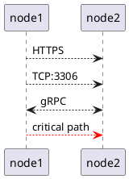
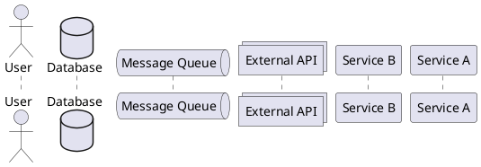
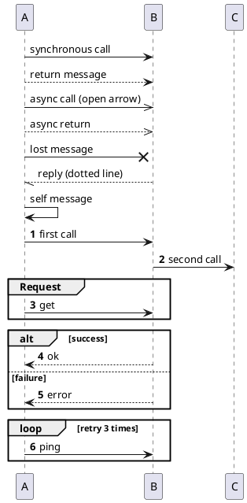
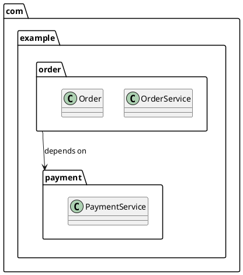
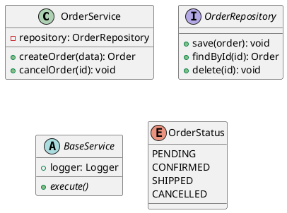
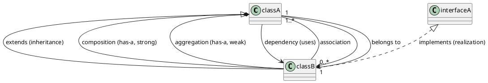
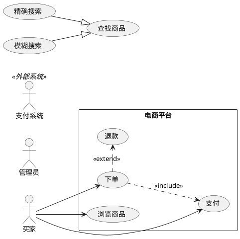
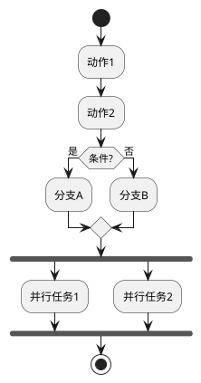
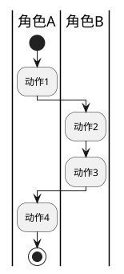
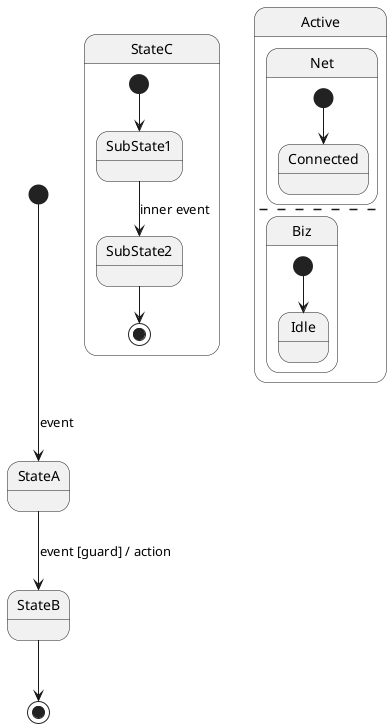

# PlantUML Syntax Reference for Architecture Diagrams

Quick reference for drawing architecture diagrams with PlantUML. Covers all 7 diagram types: Component, Deployment, Sequence, Class/Package, Use Case, Activity, and State Machine.

## General Rules

- Every diagram starts with `@startuml` and ends with `@enduml`
- Use `skinparam` at the top for consistent styling
- Comments: use `'` (single quote) for line comments
- Multi-line titles: `title` keyword, supports `\n` for newlines

## 1. Component Diagram

Purpose: Show system modular decomposition — components, interfaces, and their dependencies.

### Elements

```plantuml
@startuml
' Component
component "Component Name" as alias

' Interface (lollipop style)
interface "Interface Name" as alias

' Package / Boundary
package "Package Name" {
  component [Inner] as inner
}

' Database (stereotype)
database "DB Name" as alias

' Cloud / Actor
cloud "Cloud Service" as alias
actor "User/Role" as alias
@enduml
```

### Relationships

```plantuml
@startuml
' Dependency
A --> B : uses

' Interface required/provided
A -()- B : provides

' Note
note left of A : description
note right of B : description
note on link : description

' Grouping relationship
A -[hidden]-> B  ' hidden line for layout
@enduml
```

### Styling

```plantuml
@startuml
skinparam componentStyle rectangle  ' rectangle or uml2
skinparam component {
  BackgroundColor #E1F5FE
  BorderColor #0288D1
  FontColor #000000
}
skinparam interface {
  BackgroundColor #FFF9C4
  BorderColor #FBC02D
}
skinparam package {
  BackgroundColor #F3E5F5
  BorderColor #7B1FA2
  FontStyle bold
}
skinparam ArrowColor #666666
@enduml
```

## 2. Deployment Diagram

Purpose: Show physical deployment topology — nodes, artifacts, and communication paths.

### Elements

```plantuml
@startuml
' Node (server/container)
node "Node Name" as alias {
  [Artifact] as art
}

' Database stereotype
database "DB Name" as alias

' Cloud stereotype
cloud "Cloud" as alias

' Frame (logical grouping)
frame "Logical Group" {
  node [Inner]
}

' Collections / Stack
collections "Cluster" as alias
stack "Stack" {
  node [Instance 1]
  node [Instance 2]
}
@enduml
```

### Communication



### Styling

```plantuml
@startuml
skinparam node {
  BackgroundColor #E8F5E9
  BorderColor #388E3C
}
skinparam database {
  BackgroundColor #FCE4EC
  BorderColor #D32F2D
}
skinparam cloud {
  BackgroundColor #E3F2FD
  BorderColor #1565C0
}
skinparam frame {
  BackgroundColor #FFF3E0
  BorderColor #E65100
  FontStyle italic
}
@enduml
```

## 3. Sequence Diagram

Purpose: Show interaction flow between components over time.

### Participants



### Messages



### Activation / Lifeline

```plantuml
@startuml
participant A
participant B

activate A
A -> B : request
activate B
B --> A : response
deactivate B
deactivate A

' Short form (auto activate/deactivate)
A ->++ B : request
B -->-- A : response

' Notes
note left of A : processing
note over A, B : shared note
@enduml
```

### Styling

```plantuml
@startuml
skinparam participant {
  BackgroundColor #E3F2FD
  BorderColor #1565C0
}
skinparam actor {
  BackgroundColor #FFF9C4
  BorderColor #F9A825
}
skinparam database {
  BackgroundColor #FCE4EC
  BorderColor #C62828
}
skinparam ArrowColor #333333
skinparam SequenceLifeLineBorderColor #999999
@enduml
```

## 4. Class / Package Diagram

Purpose: Show code-level module/package structure and class relationships.

### Packages



### Classes & Interfaces



### Relationships



### Styling

```plantuml
@startuml
skinparam package {
  BackgroundColor #F3E5F5
  BorderColor #7B1FA2
}
skinparam class {
  BackgroundColor #FFF8E1
  BorderColor #F9A825
  BorderThickness 2
}
skinparam interface {
  BackgroundColor #E8F5E9
  BorderColor #388E3C
}
skinparam abstractClass {
  BackgroundColor #FCE4EC
  BorderColor #C62828
}
skinparam enum {
  BackgroundColor #E3F2FD
  BorderColor #1565C0
}
skinparam ArrowColor #555555
@enduml
```

## 5. Use Case Diagram

Purpose: Show system functions from user perspective — actors, use cases, and their relationships.

### Elements



### Styling

```plantuml
@startuml
skinparam actor {
  BackgroundColor #FFF9C4
  BorderColor #F9A825
}
skinparam usecase {
  BackgroundColor #E8F5E9
  BorderColor #388E3C
}
skinparam rectangle {
  BackgroundColor #FAFAFA
  BorderColor #9E9E9E
}
@enduml
```

## 6. Activity Diagram

Purpose: Show business process or workflow — control flow, decisions, forks/joins, and swimlanes.

### Elements



### Swimlanes



### Styling

```plantuml
@startuml
skinparam activity {
  BackgroundColor #E3F2FD
  BorderColor #1565C0
  FontColor #000000
}
skinparam swimlane {
  BackgroundColor #F5F5F5
  BorderColor #9E9E9E
}
@enduml
```

## 7. State Machine Diagram

Purpose: Show object lifecycle — states, transitions, events, guards, and actions.

### Elements



### Styling

```plantuml
@startuml
skinparam state {
  BackgroundColor #E8F5E9
  BorderColor #388E3C
  FontColor #000000
}
skinparam ArrowColor #555555
@enduml
```

## Quick Syntax Reference by Diagram Type

| Diagram | Key Elements | Relationship Syntax |
|---------|-------------|-------------------|
| **Component** | `component [Name]`, `package "Name" {}`, `interface "Name"` | `-->` dependency |
| **Deployment** | `node "Name" {}`, `database "Name"`, `cloud "Name"` | `-->` with protocol label |
| **Sequence** | `participant "Name"`, `actor "Name"`, `database "Name"` | `->` sync, `-->>` async, `activate`/`deactivate` |
| **Class/Package** | `class`, `interface`, `enum`, `package {}` | `--|>` inherit, `*--` compose, `o--` aggregate, `..>` depend |
| **Use Case** | `actor "Name"`, `usecase`, `rectangle "边界" {}` | `-->` associate, `..>` include, `.>` extend, `--|>` generalize |
| **Activity** | `start`/`stop`, `:action;`, `if/else`, `fork/end fork` | `->` control flow, `|泳道|` swimlane |
| **State Machine** | `[*]`, `state "Name"`, composite state `{}`, `--` concurrent | `-->` transition with `event [guard] / action` |

## Common Patterns

### Layered Architecture (Component)

```plantuml
@startuml
skinparam package {
  BackgroundColor #FAFAFA
  BorderColor #9E9E9E
}

package "Presentation Layer" {
  component [Web UI] as web
  component [Mobile App] as mobile
}

package "Business Layer" {
  component [Order Service] as order
  component [User Service] as user
}

package "Data Layer" {
  database [MySQL] as mysql
  database [Redis] as redis
}

web --> order
mobile --> order
order --> mysql
order --> redis
user --> mysql
@enduml
```

### Microservice Architecture (Component + Deployment)

```plantuml
@startuml
cloud "API Gateway" as gw
node "K8s Cluster" {
  component [Service A] as svcA
  component [Service B] as svcB
}
database "DB" as db
queue "Kafka" as mq

gw --> svcA : REST
gw --> svcB : REST
svcA --> mq : publish
mq --> svcB : subscribe
svcA --> db : read/write
svcB --> db : read
@enduml
```

### Request Lifecycle (Sequence)

```plantuml
@startuml
actor Client
participant Gateway
participant Auth
participant Service
database DB

Client -> Gateway: POST /api/orders
activate Gateway
Gateway -> Auth: validateToken()
activate Auth
Auth --> Gateway: valid
deactivate Auth
Gateway -> Service: createOrder()
activate Service
Service -> DB: INSERT
DB --> Service: ok
Service --> Gateway: 201
deactivate Service
Gateway --> Client: 201 Created
deactivate Gateway
@enduml
```

## Tips

1. **Use `skinparam` consistently**: Copy the same skinparam block across all diagrams in one document
2. **Keep aliases meaningful**: `[OrderService] as OS` is better than `[C1]`
3. **Add labels to relationships**: `A --> B : uses via HTTP` is self-documenting
4. **Use `note` for non-obvious details**: protocol, port, SLA, etc.
5. **Split large diagrams**: If a diagram exceeds 15 elements, split into overview + drill-down
6. **Maximize rendering quality**: Always include `skinparam dpi 300` and `scale 2` in the style block (see `plantuml-style.md`); this ensures PNG is 300 DPI high-resolution and SVG geometry has sufficient detail. Combined with `ArrowThickness 2` and `BorderThickness 2`, diagrams remain crisp when zoomed or scaled.
7. **For detailed how-to per diagram type**: See `references/howto/` — each guide provides step-by-step instructions with complete examples
