# PlantUML 官方文档

> 来源: https://plantuml.com/zh/
> 获取时间: 2026-05-12

---

## PlantUML 一览

PlantUML 是一个通用性很强的工具，可以快速、直接地创建各种图表。利用简单直观的语言，用户可以毫不费力地绘制各种类型的图表。

- 官方语言参考指南：《PlantUML 语言参考指南》
- 快速入门页面：https://plantuml.com/zh/starting
- 常见问题页面：https://plantuml.com/zh/faq

PlantUML 可以与其他各种工具无缝集成，以增强您的工作流程。

---

## 支持的 UML 图表

使用 PlantUML，您可以创建结构良好的 UML 图表：

| 图表类型 | 链接 | 说明 |
|---------|------|------|
| 序列图 | https://plantuml.com/zh/sequence-diagram | 描述对象间交互 |
| 用例图 | https://plantuml.com/zh/use-case-diagram | 描述系统功能 |
| 类图 | https://plantuml.com/zh/class-diagram | 描述类结构和关系 |
| 对象图 | https://plantuml.com/zh/object-diagram | 描述对象实例 |
| 活动图 | https://plantuml.com/zh/activity-diagram-beta | 描述流程和工作流 |
| 组件图 | https://plantuml.com/zh/component-diagram | 描述系统组件 |
| 部署图 | https://plantuml.com/zh/deployment-diagram | 描述物理部署 |
| 状态图 | https://plantuml.com/zh/state-diagram | 描述状态转换 |
| 时序图 | https://plantuml.com/zh/timing-diagram | 描述时间约束 |

---

## 支持的非 UML 图表

| 图表类型 | 说明 |
|---------|------|
| JSON 数据 | 可视化 JSON 数据结构 |
| YAML 数据 | 可视化 YAML 数据结构 |
| EBNF 图表 | 扩展巴科斯范式 |
| Regex 图表 | 正则表达式可视化 |
| 网络图 (nwdiag) | 网络拓扑 |
| 用户界面模型 (salt) | UI 原型 |
| 架构图 (Archimate) | 企业架构 |
| 规范和描述语言（SDL） | 协议描述 |
| Ditaa 图表 | ASCII Art 转图 |
| 甘特图 | 项目管理 |
| 思维导图 | 思维整理 |
| WBS 图表 | 工作分解结构 |
| 数学表达式 | AsciiMath / JLaTeXMath |
| 信息工程图 | 数据建模 |
| 实体关系图 | 数据库设计 |
| Chart diagram | 图表 |
| Files diagram | 文件树 |

---

## 其他功能

- 超链接和工具提示：提供额外的上下文和交互性
- 丰富的文本格式、表情符号、Unicode 和 Creole 图标
- OpenIconic 图标：增强可视化表示
- Sprite 图标：添加自定义符号
- AsciiMath 数学表达式：精确的数学表示

---

## 输入格式

PlantUML 允许从各种源输入格式生成图表，可以选择不同的内部编码（PlantUML 文本编码）。

---

## 布局引擎和选项

PlantUML 允许使用几种不同的布局引擎：

| 引擎 | 说明 | 使用方式 |
|------|------|---------|
| Graphviz | 默认引擎，依赖外部程序 | 默认 |
| Smetana | Graphviz 的 Java 内部移植，箭头更直 | `!pragma layout smetana` |
| VizJs | 使用 JavaScript，节点间距更大 | `-graphvizdot vizjs` |
| ELK | Eclipse Layout Kernel，仅支持正交布局 | `!pragma layout elk` |

时序图有 2 个引擎：

- **Puma**：较老的默认引擎
- **Teoz**：新引擎，支持锚点、持续时间、嵌套框 — 使用 `!pragma teoz true`

---

## 输出格式

- PNG：便于图像共享
- SVG：用于可缩放的矢量图形
- LaTeX：用于高质量排版
- ASCII art：用于基于文本的表示（仅适用于序列图）

---

## 时序图详细语法

### 基本示例

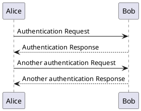

箭头类型：
- `->` 实线箭头
- `-->` 虚线箭头
- `<-` 反向实线箭头
- `<--` 反向虚线箭头

### 声明参与者

使用关键字来声明不同类型的参与者：

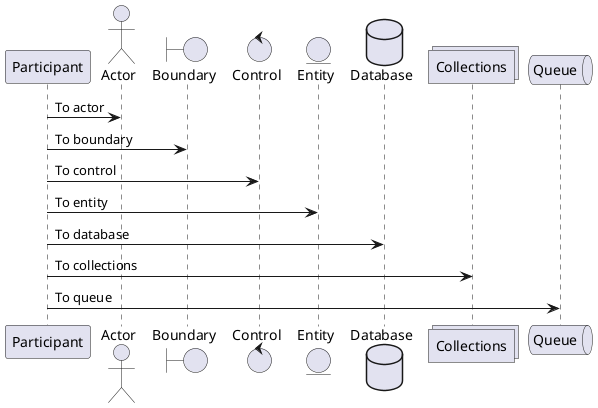

参与者类型：`participant`、`actor`（角色）、`boundary`（边界）、`control`（控制）、`entity`（实体）、`database`（数据库）、`collections`（集合）、`queue`（队列）

#### 设置颜色和别名

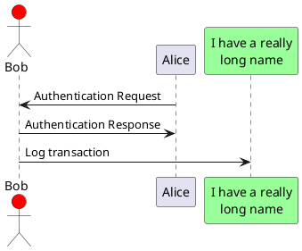

#### 自定义显示顺序

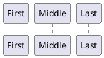

### 给自己发消息

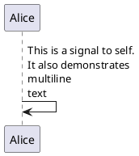

### 改变箭头样式

```plantuml
@startuml
Bob ->x Alice        ' 丢失的消息
Bob -> Alice         ' 普通
Bob ->> Alice        ' 细箭头
Bob -\ Alice         ' 半箭头（上）
Bob \\- Alice        ' 半箭头（下）
Bob //-- Alice       ' 虚线半箭头
Bob ->o Alice        ' 圆圈箭头
Bob o\\-- Alice      ' 双向圆圈
Bob <-> Alice        ' 双向箭头
@enduml
```

### 修改箭头颜色

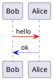

### 对消息序列编号

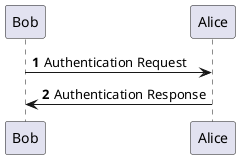

指定初始值和增量：

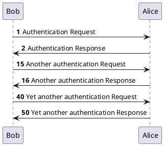

### 组合消息

关键词：`alt/else`、`opt`、`loop`、`par`、`break`、`critical`、`group`

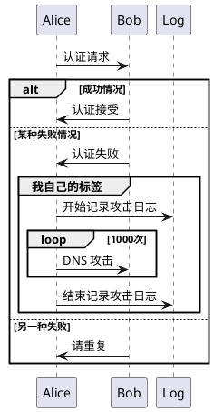

### 注释信息

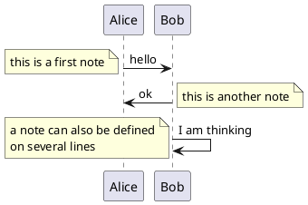

在参与者位置添加注释：

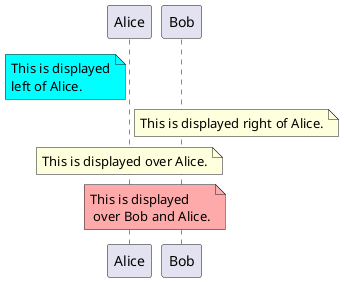

### 分隔符

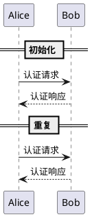

### 生命线的激活与撤销

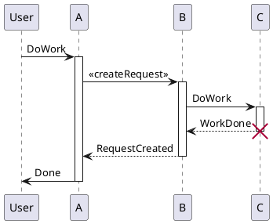

快捷语法：

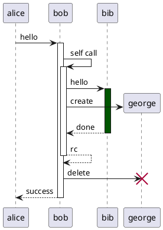

- `++` 激活目标
- `--` 撤销激活源
- `**` 创建目标实例
- `!!` 摧毁目标实例

### 延迟

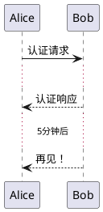

### 空间

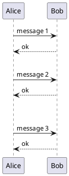

### 包裹参与者

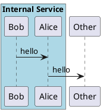

### 引用

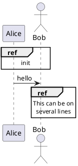

### 页面标题、页眉和页脚

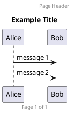

### 外观参数(skinparam)

```plantuml
@startuml
skinparam sequenceArrowThickness 2
skinparam roundcorner 20
skinparam maxmessagesize 60
skinparam sequenceParticipant underline

actor User
participant "First Class" as A
participant "Second Class" as B
participant "Last Class" as C

User -> A: DoWork
activate A

A -> B: Create Request
activate B

B -> C: DoWork
activate C
C --> B: WorkDone
destroy C

B --> A: Request Created
deactivate B

A --> User: Done
deactivate A
@enduml
```

### 锚点和持续时间（Teoz 引擎）

```plantuml
@startuml
!pragma teoz true

{start} Alice -> Bob : start doing things during duration

Bob -> Max : something
Max -> Bob : something else

{end} Bob -> Alice : finish

{start} <-> {end} : some time

@enduml
```

---

## 类图基本语法

```plantuml
@startuml
class Car {
  +String make
  +String model
  +int year
  +start()
  +stop()
}

class Engine {
  +int horsepower
  +String type
}

Car *-- Engine : contains
@enduml
```

关系类型：
- `<|--` 继承（泛化）
- `*--` 组合
- `o--` 聚合
- `-->` 依赖
- `--` 关联
- `..>` 实现

---

## 活动图基本语法

```plantuml
@startuml
start
:Hello world;
:This is defined on
several **lines**;

if (Shall we continue?) then (yes)
  :Activity;
else (no)
  :Stop;
  stop
endif

:Finish;
stop
@enduml
```

---

## 组件图基本语法

```plantuml
@startuml
package "Frontend" {
  [Web App]
  [Mobile App]
}

package "Backend" {
  [API Gateway]
  [Auth Service]
  [Data Service]
}

database "Database" {
  [PostgreSQL]
}

[Web App] --> [API Gateway]
[Mobile App] --> [API Gateway]
[API Gateway] --> [Auth Service]
[API Gateway] --> [Data Service]
[Data Service] --> [PostgreSQL]
@enduml
```

---

## 推荐资源

- 官方网站: https://plantuml.com/zh/
- 在线服务器: https://www.plantuml.com/plantuml/uml/
- 语言参考指南(PDF): https://plantuml.com/zh/guide
- 快速入门: https://plantuml.com/zh/starting
- 常见问题: https://plantuml.com/zh/faq
- 标准库: https://plantuml.com/zh/stdlib
